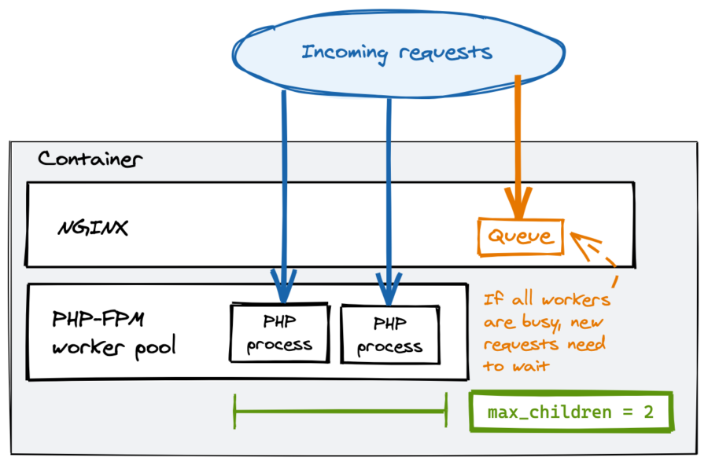
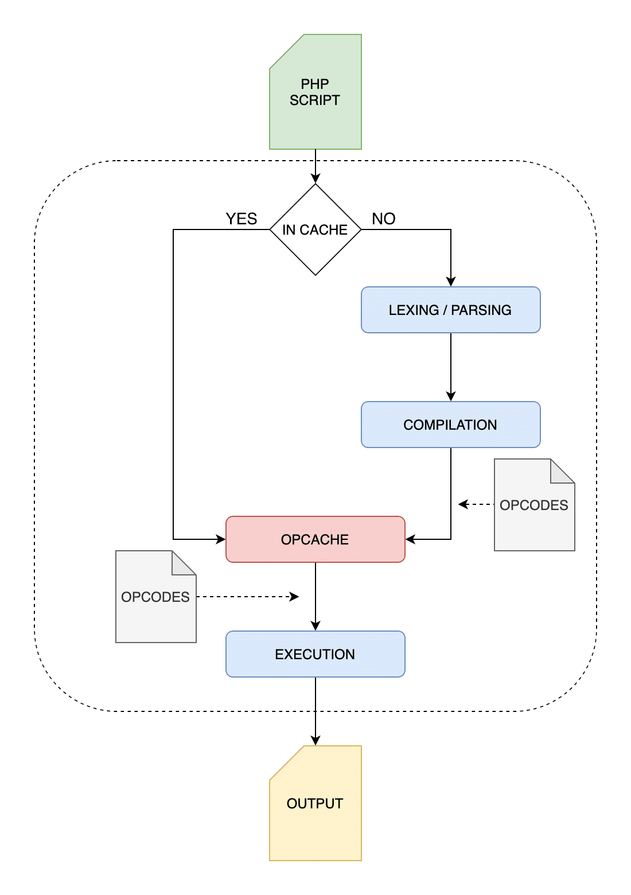
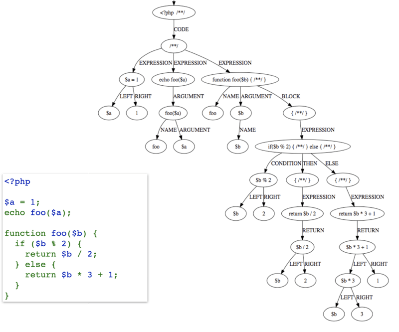
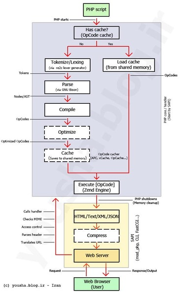
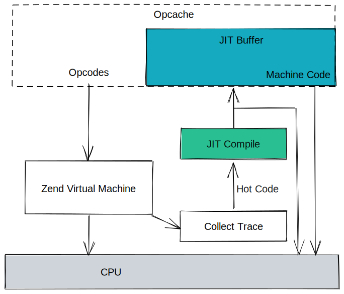

# PHP INTERNALS

In-depth Notes about PHP , PHP internals (code execution flow), what is and how PHP-FPM works and other PHP related concepts.

# Table Of Contents
- **[How does PHP work with HTTP-Servers?](#how-does-php-work-with-http-servers)**
-  **[PHP-FPM](#php-fpm)**
	-  **[Introduction](#introduction)**
	-  **[PHP-FPM’s Architecture](#php-fpms-architecture)**
-  **[How PHP works internally?](#how-php-works-internally)**
	-  **[Overview](#overview)**
	-  **[Execution Flow](#execution-flow)**
		-  **[Lexing/Tokenizing](#lexingtokenizing)**
		-  **[Parsing](#parsing)**
		-  **[Compilation](#compilation)**
		-  **[Interpretation](#interpretation)**
	-  **[OPcache](#opcache)**
		-  **[What is OPcache or PHP Opcode Caching?](#what-is-opcache-or-php-opcode-caching)**
		-  **[How PHP Opcode Caching Works](#how-php-opcode-caching-works)**
	-  **[JIT (Just-In-Time Compilation)](#jit-just-in-time-compilation)**
		-  **[Overview](#overview)**
		-  **[How PHP JIT Works](#how-php-jit-works)**


## How does PHP work with HTTP-Servers?

In general HTTP servers have a very clear responsibility: provide hypermedia content using the HTTP Protocol. This means that **http servers would receive a request, fetch a string content from somewhere, and respond with this string** based on the HTTP Protocol.

PHP came to make this hypermedia content dynamic, allowing developers to provide more than simple, static `.html` files.

As a scripting language, on a scripting context, PHP isolates every execution. Meaning that it doesn't share memory or other resources among executions.

On the web context we have two different ways to execute php code. One can attach PHP to http servers using a _CGI-like connection_ OR as a _module_ to http the server. The main difference between both is that **http modules share resources with the HTTP server** while as a **CGI, php has a fresh execution on every request**.

Using it as a module used to be very popular back in the days, as the communication between the http server and code execution has less friction. Meanwhile the CGI mode would, for example, rely on network communication between http server and code execution.

With PHP-FPM  a web server like nginx or Apache can easily execute php code as if it was a CLI script. Where every request is 100% isolated from each other.

This also means that the HTTP Server can scale independently from the PHP code executor. This **enables vertical scaling**.

The way php works (with FPM) is basically: **HTTP Server ⇨ PHP-FPM (Server) ⇨ PHP**.

You can read more about [Fast-CGI Protocol](https://github.com/khalid-el-masnaoui/Nginx-Notes/blob/main/ARCHITECTURE.md#nginx-fastcgi) which PHP-FPM relies on.

## PHP-FPM

#### Introduction

PHP-FPM is a simple and robust _FastCGI Process Manager_ for PHP (PHP FastCGI implementation). It works as a process manager, managing PHP processes and handling PHP requests separately from the web server. By doing so, it can efficiently handle multiple PHP requests concurrently, leading to a significant reduction in latency and improved overall performance.

Internally, PHP-FPM is organized as a **_master process_** managing pools of individual **_worker processes_**.

PHP-FPM's primary focus is on improving the **performance** of PHP-based applications.By maintaining separate PHP worker processes, it can handle a larger number of concurrent requests more efficiently (minimizing the overhead of process creation and destruction each time a request is received). It is also **Resource efficient** since it can control the number of active PHP processes based on the server's resources and the incoming request load. Providing a **stable and secure** environment for running PHP applications. If one PHP process encounters an error or becomes unresponsive, it won't affect other active processes. This isolation ensures that individual requests are isolated and do not impact the overall system stability.

#### PHP-FPM’s Architecture

PHP-FPM Internally adheres to a _master-slave architecture_. where it is organized as a “_master process_” managing pools of individual “_worker processes_.” When the web server has a request for a PHP script, the web server uses a proxy, _FastCGI_ connection to forward the request to the PHP-FPM service. The PHP-FPM service can listen for these requests on the host server’s network ports or through Unix sockets. Although requests pass via a proxy connection, the PHP-FPM service must run on the same server as the web server. Notably, the proxy connection for PHP-FPM is not the same as a traditional proxy connection. As PHP-FPM receives a proxied connection, a free PHP-FPM worker accepts the web server’s request. PHP-FPM then compiles and executes the PHP script, sending the output back to the web server. Once a PHP-FPM worker finishes handling a request, the system releases the worker and waits for new requests.

The PHP-FPM master process can dynamically creates and terminates worker processes — within configurable limits — as traffic to PHP scripts increases and decreases. The extra worker processes it spawns to handle increases in traffic terminate only after a set amount of time has passed, allowing the worker processes to remain available while increased traffic persists. Worker processes also periodically terminate and respawn after serving a fixed number of requests. This helps to prevent memory leaks during the processing of PHP scripts.

PHP-FPM’s architecture shares design similarities with event-driven web servers such as the NGINX web server and the Apache web server with the Event Multi-Processing Module. Processing PHP scripts in this way allows for much higher processing performance, improved security, better stability, and greater configurability.

<p align="center">

</p>

## How PHP works internally?

#### Overview

As stated before, PHP isolates every execution. No shared memory or shared resources among the executions.  PHP uses the Zend Engine which is the internal compiler and runtime engine.
For the execution of PHP files, we have an interpreter called “PHP Interpreter”. It is based on the Zend engine. Zend engine compiles the PHP Script into Zend Opcodes and later on execute this opcode list.

Opcodes are short for Operation codes. It is low-level binary instructions.In simple terms, php will **parse, compile and execute**.

**Note** : Syntactic errors and language checks happen during the parsing and compiling phase. Logical errors (like exceptions) occur during execution phase only.

The way PHP currently does this is by using an _Abstract Syntactic Tree_ to figure out what the things inside a php file actually mean.

This syntactic tree maps language constructs to compiling instructions, that when compiled turn into Zend VM opcodes. Such opcodes are then to be interpreted by the Zend VM and executed.

In the end of the day **having a fresh execution on every request doesn't seem that smart if we have to compile php syntax into opcode every single time**.

With **OPcache** php can benefit from a _shared memory space_: read/store already parsed script opcodes and boost future executions.

The first time a request hits `index.php`, for example, php parses, compiles and executes it. Second time a request hits `index.php`, php will simply fetch from opcache and execute it right away.

**Note** : The above behavior can be changed using _OPcache preloader_

<p align="center">

</p>


#### Execution Flow

The PHP Interpreter undergoes the following four phases:

- **Lexing (Tokenizing)**
- **Parsing**
- **Compilation**
- **Interpretation**

###### Lexing/Tokenizing

Lexing is the process of converting the PHP source code into tokens. A token in a named identifier for the value.
In this step, the PHP interpreter takes the PHP codes and builds a set of understandable units called tokens.

For example 
```php
<?php
echo "Hello world";  
```

This will convert to

```php
<?php to T_OPEN_TAG  
echo to T_ECHO  
"Hello world" to T_CONSTANT_ENCAPSED_STRING
```

[Here](https://www.php.net/manual/en/tokens.php) is the list of all parser tokens.

**Note** : We can see the output of the lexing stage via the [tokenizer](http://php.net/manual/en/book.tokenizer.php) extension.

**Note 2** : The first point is that not all pieces of the source code are named tokens. Instead, some symbols are considered tokens in and of themselves (such as `=`, `;`, `:`, `?`, etc). 

###### Parsing

Parsing is the process of recognizing tokens within a data instance and looking for recognizable patterns. The parser takes the tokens from the lexer as input and it has two tasks. First, it validates the token, and second, the parser produces the Abstract Syntax Tree( AST ) i.e a tree representation of the source code.

**AST (Abstract syntax tree):** AST, is a tree representation of the source code of a computer program that conveys the structure of the source code. Each node in the tree represents a construct occurring in the source code.

<p align="center">

</p>

**Note** : The AST output of this stage is handy to work off of for tools such as static code analysers (e.g. [PHPStan](https://github.com/phpstan/phpstan)).

###### Compilation

The compilation stage consumes the AST, where it emits opcodes by recursively traversing the tree. This stage also performs a few optimizations. These include resolving some function calls with literal arguments (such as `strlen("abc")` to `int(3)`) and folding constant mathematical expressions (such as `60 * 60 * 24` to `int(86400)`).

###### Interpretation

The final stage is the interpretation of the opcodes. This is where the opcodes are run on the Zend Engine VM. There’s actually very little to say about this stage (from a high-level perspective, at least). The output is pretty much whatever your PHP script outputs via commands such as `echo`, `print`, `var_dump`, and so on.

**Note** : A fun fact is that PHP requires itself as a dependency when generating its own VM. This is because the VM is generated by a PHP script, due to it being simpler to write and easier to maintain.

<p align="center">

</p>

#### OPcache

###### What is OPcache or PHP Opcode Caching?

OPcache is **a caching engine built into PHP** and it is a type of **OPcode caching** . OPcache stores precompiled script bytecode in shared memory, improving PHP performance. It caches opcode, allowing scripts to be served directly from the cache. This reduces CPU and memory usage, optimizing resource utilization and enhancing PHP application scalability.

With OPcache enabled, scripts are stored in memory, and only updates are compiled. It eliminates the need for PHP to recompile scripts, reducing server overhead and speeding up PHP execution.

The first time a request hits `index.php`, for example, php parses, compiles and executes it. Second time a request hits `index.php`, php will simply fetch from opcache and execute it right away.

**Note** : The above behavior can be changed using _OPcache preloader_

We have other Bytecode cache engines such as [APC](https://secure.php.net/manual/en/book.apc.php), and [Xcache](https://xcache.lighttpd.net/) 

###### How PHP Opcode Caching Works

When a PHP script executes, your server’s cache memory is checked to see if the script has already been cached. If it hasn’t, it’s parsed, which means the code is analyzed.

Then, the script is compiled into opcode making the file readable by the server. Once that’s done, the opcode is saved to the server’s memory.

In other words, it’s stored in your server’s cache. The next time a visitor loads the page with the PHP script, the cached code is executed and loaded much faster.

<p align="center">

</p>

#### JIT (Just-In-Time Compilation)

**PHP 8.0** introduces **JIT**. as a next step to improve performance of PHP applications,

###### Overview

Pure **_interpreted_ programming languages** has no compilation step, and directly executes the code in a virtual machine. Most of the interpreted languages including PHP, in fact, has a light-weight compilation step to improve its performance.

Programming languages with **Ahead-Of-Time (AOT) compilation**, on other hand requires the code to be compiled first before it runs.

**Just-In-Time** compilation is a hybrid model of interpreter and Ahead-of-Time compilation, that some or all of the code is compiled, often at run-time, without requiring the developer to manually compile it.

So far we saw that PHP code, once processed (tokenize, parse, build AST, and build opcodes), is run on Zend Virtual Machine. Similar to Java and JavaScript, the virtual machine abstracts the hardware side of the application, which makes it possible to "run" a PHP source code without compiling.

Opcache extension can help store the opcodes in a shared memory, to skip repetitive tokenize/parse/opcode steps.

PHP already includes several optimizations such as dead code elimination at Opcode level, but it was not possible to perform optimizations beyond the virtual machine level, because at that point, the code is interpreted by the virtual machine, as opposed to compiling it,  the VM still needed to compile these to native machine code.

The natural next step of reaching as close as possible to the CPU is skipping the virtual machine. JIT is. What JIT does is allow an extra layer of caching: caching of the native machine code.

**JIT** is a technique that will compile parts of the code at runtime so that the compiled version can be used instead. Think of it like a “cached version” of the interpreted code (Zend VM) , generated at runtime.

For CPU-intensive tasks, having a JIT compiler in PHP boasts significant performance gains.


###### How PHP JIT Works

**PHP JIT is implemented as a part of Opcache**. This keeps JIT separated from the PHP engine.

The three components of JIT is to store, inspect, and seamlessly invoke the code with the virtual machine or directly using the machine code stored in the buffer.

- Buffer : JIT Buffer is where the compiled CPU machine code is stored. PHP provides configuration options  (`opcache.jit_buffer_size` INI setting) to control how much memory should be allocated for the JIT buffer.

- Triggers :Triggers in Opcache are responsible in invoking the compiled machine code when it encounters a code structure. These triggers can be a function call entry, a loop, etc.

- Tracer : JIT tracer functionality inspects the code before, after, or during its execution, and determines which code is _hot_, as in which structures can be compiled with JIT.

PHP 8.0 adds two _modes_ of JIT operation. This is further customizable, but the most prominent types of JIT functionality are aliased `function` and `tracing`.


- **Function JIT** mode is a rather simple one in comparison. JIT compiles a whole function, without tracing for frequently used code structures such as loops inside a function. It still supports profiling for frequently used _functions_, and triggering a JIT compile or execution of the compiled machine code at before, after, or during the execution of an application request.

- **Tracing JIT**, that is selected by default in PHP 8.0, tries to identify the frequently used _parts_ of code, and selectively compiles those structures for the best balance of compilation time and memory usage. Not all programming languages support tracing JIT compilers, but PHP supports tracing JIT right out of the first release, and is selected by default too.

There are several configuration options that enable further tweaking how a hot code structure is determined, such as the number of function calls, number of iterations of a loop structure, etc.

<p align="center">

</p>