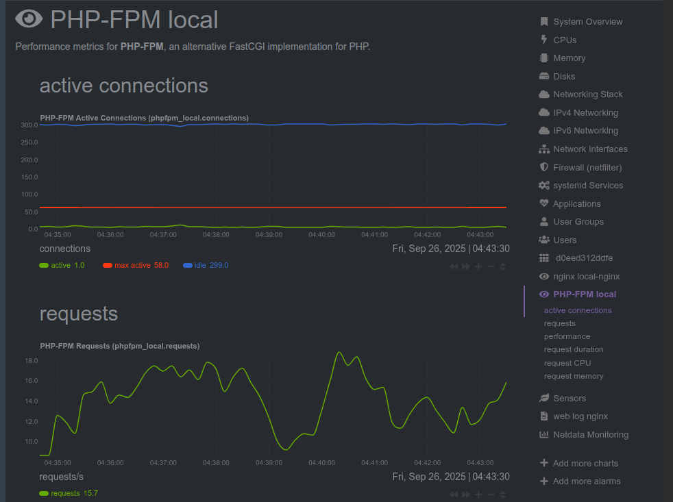
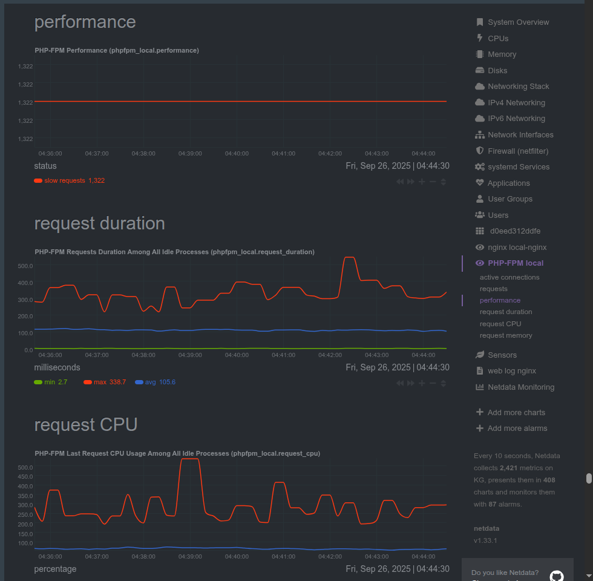

# PHP Performance Best Practices

## Overview

This document revisits the essential optimized-performance practices for PHP & PHP-FPM runtime from a practical perspective.

By following the key recommendations outlined below, you can avoid common configuration errors while ensuring optimized performances.

- **[[#What exactly is a good PHP performance?|What exactly is a good PHP performance?]]**
- **[[#Get Latest PHP|Get Latest PHP]]**
- **[[#Opcode Caching <`Opcache`>|Opcode Caching <`Opcache`>]]**
- **[[#OPcache preloading|OPcache preloading]]**
- **[[#Enable Just-In-Time (JIT) Compilation|Enable Just-In-Time (JIT) Compilation]]**
- **[[#Enable Realpath Cache|Enable Realpath Cache]]**
- **[[#Enable Realpath Cache#Turn off MySQL statistics in `php.ini`|Turn off MySQL statistics in `php.ini`]]**
- **[[#Output Buffering|Output Buffering]]**
- ****[[#Output Buffering#PHP Configuration Tuning|PHP Configuration Tuning]]****
- **[[#PHP-FPM: Fine-Tuning for High Loads|PHP-FPM: Fine-Tuning for High Loads]]**
	- **[[#PHP-FPM: Fine-Tuning for High Loads#General|General]]**
	- **[[#PHP-FPM: Fine-Tuning for High Loads#Adjusting child processes for PHP-FPM|Adjusting child processes for PHP-FPM]]**
		- **[[#Adjusting child processes for PHP-FPM#Calculate max_children|Calculate max_children]]**
- **[[#PHP Performance General Tips|PHP Performance General Tips]]**
	- **[[#PHP Performance General Tips#Database Interaction Efficiency|Database Interaction Efficiency]]**
		- **[[#Database Interaction Efficiency#Common Database-Related Performance Issues|Common Database-Related Performance Issues]]**
		- **[[#Common Database-Related Performance Issues#Techniques for Optimizing Database Queries and Interactions|Techniques for Optimizing Database Queries and Interactions]]**
	- **[[#PHP Performance General Tips#Caching|Caching]]**
	- **[[#PHP Performance General Tips#Concurrency with Asynchronous PHP|Concurrency with Asynchronous PHP]]**
	- **[[#PHP Performance General Tips#Security as a Performance Factor|Security as a Performance Factor]]**
	- **[[#PHP Performance General Tips#Minimize External Dependencies|Minimize External Dependencies]]**
	- **[[#PHP Performance General Tips#Use a Content Delivery Network (CDN)|Use a Content Delivery Network (CDN)]]**
- **[[#PHP Code Optimization|PHP Code Optimization]]**
	- **[[#PHP Code Optimization#Memory Management and Resource Handling|Memory Management and Resource Handling]]**
	- **[[#PHP Code Optimization#String Operations Optimization|String Operations Optimization]]**
	- **[[#PHP Code Optimization#Database Query Optimization|Database Query Optimization]]**
	- **[[#PHP Code Optimization#Array Operations and Loop Optimization|Array Operations and Loop Optimization]]**
	- **[[#PHP Code Optimization#Error Handling and Logging|Error Handling and Logging]]**
	- **[[#PHP Code Optimization#General|General]]**
- **[[#Monitoring, Profiling and Proactive Optimization|Monitoring, Profiling and Proactive Optimization]]**
	- **[[#Monitoring, Profiling and Proactive Optimization#Types of bottlenecks that affect PHP performance|Types of bottlenecks that affect PHP performance]]**
	- **[[#Monitoring, Profiling and Proactive Optimization#PHP Performance Monitoring & Profiling|PHP Performance Monitoring & Profiling]]**


## What exactly is a good PHP performance?

Performance and speed are not necessarily synonymous. Achieving optimal performance is often a balancing act that requires trade-offs between speed, accuracy, and scalability. For example, while building a web application, you may have to decide between prioritizing speed by writing a script that loads everything into memory up front or prioritizing scalability with a script that loads data in chunks.
## Get Latest PHP

Newer PHP versions often offer performance improvements and better features, so as  the first step keeping PHP up to date is crucial.


## Opcode Caching <`Opcache`>

Opcode caching is a powerful technique in PHP tuning that can significantly boost your web application's speed and efficiency. By caching the compiled PHP bytecode, opcode cache eliminates the need for recompilation on each request, resulting in faster response times

To enable and configure Opcache, follow these steps:
1. **Enable the extension**: Ensure the OPcache extension is enabled in your PHP configuration file (php.ini).
2. **Configure OPcache settings**: Fine-tune your OPcache settings in the php.ini ( or better inside `opcache.ini`) file to optimize performance.
```bash 
	....
	opcache.revalidate_freq=60  # default 2
	opcache.validate_timestamps=0 #disabled : default 1
	opcache.max_accelerated_files = 30000
	opcache.memory_consumption = 512
	opcache.interned_strings_buffer	= 64
	opcache.max_wasted_percentage = 15
	opcache.file_update_protection	= 0 #default 2 (s)
```
* **`opcache.revalidate_freq`** : controls how often OPcache checks for changes in PHP files. Set this value to 0 for development environments or a higher value (e.g., 60) for production environments to reduce disk I/O
* **`opcache.validate_timestamps`** :  If enabled, OPcache will check for updated scripts every `opcache.revalidate_freq`. When disabled, `opcache.revalidate_freq`  is ignored, and you must reset OPcache manually via **opcache_reset()**, **opcache_invalidate()** or by restarting PHP for changes to the filesystem to take effect.
* `max_accelerated_files` : 
	- defines the maximum number of PHP files that can be cached. Increase this value if your application has a large number of files. ( If this value is lower than the number of files in the app, the cache becomes less effective because it starts **thrashing**.)
	- determine approximately how many `.php`file are there  : `find . -type f -name '*.php' | wc -l`
	* set `opcache.max_accelerated_files` to a value slightly higher than the returned number. PHP automatically rounds the value up to the next highest prime number.
* `memory_consumption` : determines the amount of memory allocated for storing compiled bytecode. Increase this value if you have a large application or if you notice frequent cache evictions (If the app uses more than this, the cache starts **thrashing** and becomes less effective
* `interned_strings_buffer` : Sets the memory allocated for storing interned strings. Increasing this value can improve performance, especially for applications with many string literals
* `opcache.max_wasted_percentage` : determines the maximum percentage of "wasted" memory in the OPcache shared memory until a restart is scheduled.  "wasted memory" refers to memory allocated within the OPcache that is no longer being used to store active, cached scripts. This can occur when scripts are deleted, modified, or become otherwise invalid, but their corresponding bytecode still occupies space in the cache.
* `opcache.file_update_protection` : prevents caching files that are less than this number of seconds old. It protects from caching of incompletely updated files. You may increase performance by setting this to “0” (ensure your file update are **atomic**).


3.  **Monitor OPcache performance**: Use monitoring tools like **opcache_get_status()** or third-party solutions like the **OPcache GUI**  or **CachTool** to review cache usage, cache hits, and other relevant metrics. Analyzing this data can help you fine-tune your OPcache settings for optimal performance.

```shell
# CachTool
php cachetool.phar opcache:status --fcgi=/var/run/php5-fpm.sock #php-fpm
php cachetool.phar opcache:status --cli #cli
```

| Name                 | Value                           |
| -------------------- | ------------------------------- |
| Enabled              | Yes                             |
| Cache full           | No                              |
| Restart pending      | No                              |
| Restart in progress  | No                              |
| Memory used          | 66.83 MiB                       |
| Memory free          | 444.8 MiB                       |
| Memory wasted (%)    | 381.68 KiB (0.072799623012543%) |
| Strings buffer size  | 48 MiB                          |
| Strings memory used  | 503.22 KiB                      |
| Strings memory free  | 47.51 MiB                       |
| Number of strings    | 10569                           |
| Cached scripts       | 59                              |
| Cached keys          | 63                              |
| Max cached keys      | 32531                           |
| Start time           | Fri, 18 Jul 2025 07:43:21 +0900 |
| Last restart time    | Never                           |
| Oom restarts         | 0                               |
| Hash restarts        | 0                               |
| Manual restarts      | 0                               |
| Hits                 | 234846874                       |
| Misses               | 86                              |
| Blacklist misses (%) | 0 (0%)                          |
| Opcache hit rate     | 99.999963380407                 |
## OPcache preloading

OPcache preloading (`PHP +7.4`) loads selected files into shared memory, making their content (functions, classes) globally available for requests when the PHP engine starts. It also removes the need to include these files later. 

* To enable preloading, add a variable that specifies a preload script in the `php.ini`:
````shell
opcache.preload=/path/to/your/preload.php
````
* Create a PHP script `preload.php` that explicitly lists and includes the files you want to preload. This script will be executed once when the PHP process starts.
```php 
<?php  
// preload.php  
opcache_compile_file(__DIR__ . '/path/to/your/important-file.php');  
opcache_compile_file(__DIR__ . '/path/to/another/important-file.php');  
// You can also use require_once or include_once for files  
// require_once __DIR__ . '/vendor/autoload.php'; // Example for Composer autoload  


## preload all php files in a specific directory
# Define the directory to preload  
$directoryToPreload = '/path/to/your/application/src'; // Replace with your target directory  
  
// Function to recursively find and preload PHP files  
function preloadDirectory($directory) {  
	$directoryIterator = new RecursiveDirectoryIterator($directory, RecursiveDirectoryIterator::SKIP_DOTS)
	$files = new RecursiveIteratorIterator($directoryIterator, RecursiveIteratorIterator::LEAVES_ONLY  
);  
  
	foreach ($files as $file) {  
		if ($file->isFile() && $file->getExtension() === 'php') {  
			opcache_compile_file($file->getPathname());  
		}  
	}  
}  
  
// Execute the preloading  
preloadDirectory($directoryToPreload);

```

## Enable Just-In-Time (JIT) Compilation

**PHP 8** introduced the JIT compiler as a core feature, offering a new avenue for PHP tuning.

* ***Upgrade to PHP 8**: Ensure your application is compatible with PHP 8 and take advantage of its new features, including the JIT compiler, improved syntax, and other performance optimizations.
* **Configure JIT settings**: Fine-tune your JIT settings in the php.ini file to optimize performance.
```shell
# php.ini

opcache.enable = 1 # opache must be enabled
opcache.jit_buffer_size =  # determines the amount of memory allocated for storing compiled machine code
opcache.jit = on  # default 'tracing/on' JIT compilation mode[check INTERNALS.md]
```

## Enable Realpath Cache

The PHP realpath cache is a mechanism within PHP that stores the resolved, canonical paths of files and directories. When PHP needs to access a file, it often first needs to determine its absolute path, resolving any symbolic links, relative path components (like `.` or `..`), and directory separators. This process can be computationally intensive, especially when dealing with complex file structures or frequent file access.

- When a file path is first requested in PHP (e.g., through `include`, `require`, `file_exists()`, `realpath()`), PHP resolves its real path on the filesystem.
- This resolved path, along with other metadata like expiration time, is then stored in the `realpath` cache.
- Subsequent requests for the same file path can then retrieve the real path directly from the cache, avoiding the need for repeated filesystem lookups.

```shell
realpath_cache_size = 4M # the maximum size of the realpath cache in bytes.
realpath_cache_ttl = 300 #he time-to-live (TTL) for realpath cache entries in seconds. After this duration, an entry is considered expired and will be re-resolved on the next access.
```


## Turn off MySQL statistics in `php.ini`

Make sure on your production servers, both of these settings **`mysqlnd.collect_statistics`** and **`mysqlnd.collect_memory_statistics`** are disabled. It should always be disabled unless you have a specific reason to enable it.

You can view MySQL run-time statistics using the MySQL command line (ex. `show status;`)

```shell
mysqlnd.collect_statistics = Off
mysqlnd.collect_memory_statistics = Off
```


## Output Buffering

PHP's `output_buffering` is a mechanism that controls how PHP manages the output generated by a script before it's sent to the client (e.g., a web browser). Instead of sending data to the client as it's generated, `output_buffering` allows PHP to store this output in an internal buffer.

- **Flushing:** 
    The content of the buffer is sent to the client only after the script finishes execution, or when explicitly flushed using functions like `ob_end_flush()` or `ob_implicit_flush()`.

- **Sending Headers After Output:** 
    This is a crucial benefit. HTTP headers (like `Set-Cookie`, `Location` for redirects, or `Content-Type`) must be sent before any actual content. If you generate output before setting a header, PHP will typically issue a "**headers already sent**" error. Output buffering allows you to buffer the content, set headers later in the script, and then send both together.

```shell
output_buffering = 4096 # Enables buffering with a maximum size of 4096 bytes
```

- Using `ob_start()` function: This function can be called within your PHP script to start output buffering at a specific point (even if it is not enabled in `php.ini`). It offers more granular control and allows for custom output handlers. (used with `ob_end_flush()`)

## PHP Configuration Tuning

There are several directives that can be tuned for performance like `memory_limit`,  `max_execution_time`, `upload_max_filesize`, and `post_max_size` should be configured according to the needs of your site.

example configuration : 

```shell
memory_limit = 128M
max_execution_time = 30
max_input_time = 60
post_max_size = 1.5M
upload_max_filesize = 1.1M
```


## PHP-FPM: Fine-Tuning for High Loads

### General
PHP-FPM helps improve your app’s performance by maintaining pools of workers that can process PHP requests. This is essential when your app needs to handle a high number of simultaneous requests.  The `pm.static` configuration can offer maximum performance.


The PHP-FPM _pm static_ setting depends heavily on how much free memory your server has. If you suffer from low server memory, then pm _ondemand_ or _dynamic_ maybe be better options. On the other hand, if you have the memory available, you can avoid much of the PHP process manager (PM) overhead by setting pm _static_ to the max capacity of your server.
*  `pm.static` should be set to the max amount of PHP-FPM processes that can run _without creating memory availability or cache pressure issues_

```shell
# pool.conf
pm = static
pm.max_children = 30
pm.max_requests = 1000 # avoiding memory leaks
```

### Adjusting child processes for PHP-FPM

When setting these options consider the following:

- How long is your average request?
- How much memory on average does each child process consume?


```shell
## Determine if the max_children limit has been reached
sudo grep max_children /var/log/php?.?-fpm.log #Proactive Optimization

## php-fpm average memory usage
ps --no-headers -o "rss,cmd" -C php-fpm7.0 | awk '{ sum+=$1 } END { printf ("%d%s\n", sum/NR/1024,"M") }'

## print every php-fpm process memeory
ps -eo size,pid,user,command --sort -size | awk '{ hr=$1/1024 ; printf("%13.2f Mb ",hr) } { for ( x=4 ; x<=NF ; x++ ) { printf("%s ",$x) } print "" }' | grep php-fpm
```

#### Calculate max_children
* **based on RAM** :
	* `pm.max_children = Total RAM dedicated to the web server / Max child process size`
 * **Based on average script execution time** :
	 * -`max_children = (average PHP script execution time) * (PHP requests per second)`


## PHP Performance General Tips

### Database Interaction Efficiency
Database interactions are often a major source of performance issues in PHP applications. Optimizing performance monitoring your database queries and interactions can significantly improve your application's responsiveness and overall performance.

#### Common Database-Related Performance Issues

* **Slow or un-optimized queries**: Complex or poorly-written SQL queries can lead to excessive execution time and consume server resources.

* **Lack of indexing**: Missing or inadequate database indexes can slow queries and result in slow query performance due to full table scans.

* **Excessive database connections**: Opening and closing numerous database connections can introduce latency and consume system resources.

* **Inefficient data fetching**: Fetching large amounts of data, especially when only a small portion is needed, can slow down your application.
#### Techniques for Optimizing Database Queries and Interactions

* **Optimize SQL queries**: Analyze and optimize your SQL queries using tools like `EXPLAIN` or the `MySQL Query Analyzer`. Consider using  JOINs, subqueries, or temporary tables to improve query performance.

- **Use indexes**: Create and maintain appropriate indexes on your database tables to speed up query execution. Be mindful of over-indexing, as it can lead to slower write operations.

- **Connection pooling**: Implement connection pooling to reuse database connections, reducing the overhead of opening and closing connections (need php to be `stateful` => can only achieved by using `swoole`, or using external pooling solution like `ProxySQL`).

- **Fetch data efficiently**: Limit the amount of data fetched from the database by using the `SELECT` clause to request only the necessary columns and applying `LIMIT` and `OFFSET` clauses for pagination.  Avoid `N+1 query problem`

* **Opening/closing database connections** : Un-setting variables and closing database connections in your code will save precious memory. Also consider using singleton pattern for when trying to open/use a database connection


### Caching

Caching is a powerful technique that can drastically improve the performance of your PHP applications. By storing and reusing data or computations, caching can reduce the need for expensive database queries or complex calculations.

* **Object caching**: Storing and reusing the results of database queries or expensive calculations to reduce the need for repeated database operations.
	* Using `Redis`, `Memecache`, `APCu`

* **Page caching**: Saving and reusing the output of entire HTML pages to minimize the need for server-side processing on subsequent requests.
	* Using `HTTP-Caching` => check my repository [Nginx-Notes](https://github.com/khalid-el-masnaoui/Nginx-Notes)
	* `Nginx FastCGI cache`:  is a caching solution that works with Nginx. Nginx FastCGI cache allows you to cache the response of a FastCGI application, such as a PHP, in memory, reducing the number of requests made to the application server as well as drastically reducing response times. (!!for content that is not highly personalized or frequently changing. & not relying on authentication !!)
### Concurrency with Asynchronous PHP

Asynchronous operations allow your code to continue running while waiting for a response from an external resource, such as a database or API. This can improve performance by allowing your server to handle more requests at once.

Modern PHP applications can benefit from asynchronous programming to handle multiple tasks concurrently. Libraries like `ReactPHP` or frameworks like `Swoole` can be used to write non-blocking code, which is particularly beneficial for APIs or applications that rely on network communication.

### Security as a Performance Factor

Implementing SSL/TLS, adds a layer of encryption that, if not properly configured, can slow down the site. Tools like Let’s Encrypt with OCSP stapling can help in maintaining both security and performance.

Optimize the performance of Nginx by supporting the latest TLS protocols (`TLS 1.2 & TLS 1.3`) and enabling `HTTP/2` and `HTTP/3 & QUIC`

```shell
#check http/2 and htpp/3 are enabled
curl --http2 -I https://example.com/
curl --http3 -I https://example.com/
```

For more nginx performance tuning, please check my repository  [Nginx-Notes](https://github.com/khalid-el-masnaoui/Nginx-Notes)
### Minimize External Dependencies

External dependencies, such as third-party libraries, can impact performance if not properly optimized. Consider using only the necessary dependencies and optimizing them for your use case.

```shell
#detect composer un-used packages 
composer-dependency-analyser
composer-unused

# optimize composer
composer dump-autoload -o
```

### Use a Content Delivery Network (CDN)

A CDN is a network of servers that are distributed across different geographic locations. By storing static content on these servers, you can reduce the amount of time it takes for your content to be delivered to users, as well as reduce the load on your own server by offload static resources from your PHP application. Popular CDN services for PHP include `Cloudflare` and `Amazon CloudFront`.

On top of caching static assets , you can minify them. It is recommended minifying the static scripts so that the processing time can be decreased. This can be achieved by using composer packages like `matthiasmullie/minify` 

## PHP Code Optimization

### Memory Management and Resource Handling

Memory management in PHP is crucial because poor management can lead to memory leaks and degraded performance.

- Using generators (`yield`) prevents loading entire files/resources into memory
	- **Traditional iterator**: build the whole array, then loop.
	-  **Generator**: compute and `yield` one value at a time, on demand.
	-  **Database cursors**  : Fetch rows one by one to avoid loading the entire result-set.
- The `finally` block ensures resources are always freed
- Processing data in chunks reduces memory footprint
- Explicitly un-setting variables when no longer needed helps garbage collection

```php

//----------------------------------------------------

//processing large files, line by line
function processLargeFile($filePath) {
    // Using fopen in 'r' mode for memory efficiency
    $handle = fopen($filePath, 'r');
    if (!$handle) {
        throw new RuntimeException('Failed to open file');
    }

    try {
        while (!feof($handle)) {
            // Using yield instead of storing all lines in memory
            yield fgets($handle);
        }
    } finally {
        // Ensure file handle is always closed, even if an exception occurs
        fclose($handle);
    }
}

// Example of processing a 1GB file with minimal memory usage
function processGiantLogFile($logPath) {
    $stats = ['errors' => 0, 'warnings' => 0];

    foreach (processLargeFile($logPath) as $line) {
        // Process one line at a time instead of loading entire file
        if (strpos($line, 'ERROR') !== false) {
            $stats['errors']++;
        } elseif (strpos($line, 'WARNING') !== false) {
            $stats['warnings']++;
        }

        // Free up memory after processing each line
        unset($line);
    }

    return $stats;
}

// --------------------------------------------------

// database cursor
function getDatabaseRows(PDO $pdo, string $query): Generator  
{  
	$stmt = $pdo->query($query); // Or $pdo->prepare($query) and then $stmt->execute()  
	try {
		while ($row = $stmt->fetch(PDO::FETCH_ASSOC)) {  
			yield $row;  
		}  
	} finally {
		$stmt->closeCursor();
		# $stmt = null;
	}
	
}

// Iterate with the Generator
$pdo->setAttribute(PDO::MYSQL_ATTR_USE_BUFFERED_QUERY, false);
$rowsGenerator = getDatabaseRows($pdo, "SELECT * FROM large_table");  
  
foreach ($rowsGenerator as $row) {  
	// Process each row here  
	echo $row['column_name'] . "\n";  
}

/*
- **Unbuffered Queries:** 
    Generators naturally align with unbuffered queries, where data is fetched row by row from the database server. 
    Be aware of the implications of unbuffered queries, such as the inability to send further queries 
    over the same connection until the result set is exhausted.
*/
```

* **Buffered Queries :**  Queries are using the buffered mode by default. This means that query results are immediately transferred from the MySQL Server to PHP and then are kept in the memory of the PHP process. This allows additional operations like counting the number of rows, and moving (seeking) the current result pointer. It also allows issuing further queries on the same connection while working on the result set. The downside of the buffered mode is that larger result sets might require quite a lot memory. The memory will be kept occupied till all references to the result set are unset or the result set was explicitly freed, which will automatically happen during request end at the latest.

- **Un-buffered queries**:  Should be used only when a large result set is expected that will be processed sequentially. Unbuffered queries contain a number of pitfalls that makes it more difficult to use them, (e.g. the number of rows in the result set is unknown until the last row is fetched,  increase the load on the server.). Buffered queries are the easier and more flexible way to process result sets.


**Example for handling large files upload in chunks** 
```php 

//----------------------------------------------------

// File upload in chunks using Plupload

# you can fine examples here : 
-- https://www.plupload.com/docs/v2/Chunking
-- https://www.techbreeze.in/uploading-large-files-in-chunks-with-plupload-and-php/

-- https://github.com/moxiecode/plupload-handler-php/blob/master/PluploadHandler.php
```
### String Operations Optimization

String operations in PHP can be memory-intensive: 
- Using `implode()` instead of string concatenation
- Output buffering for building large strings
- Using `strtr()` for multiple replacements
- Precompiling regex patterns
- Using `sprintf()` for format strings
- Single quotes over double quotes. Double quotes check for variables, which can drag down performance.

```php
class StringOptimizer {
    public function efficientConcatenation(array $strings): string {
        // Use implode instead of concatenation
        return implode('', $strings);
    }

    public function buildLargeHtml(array $data): string {
        // Use output buffering for large string building
        ob_start();

        echo '<div class="container">';
        foreach ($data as $item) {
            printf(
                '<div class="item">%s</div>',
                htmlspecialchars($item, ENT_QUOTES, 'UTF-8')
            );
        }
        echo '</div>';

        return ob_get_clean();
    }

    public function efficientStringReplacement(string $subject, array $replacements): string {
        // Use strtr for multiple replacements instead of str_replace
        return strtr($subject, $replacements);
    }

    public function processLargeText(string $text): string {
        // Precompile regex patterns for better performance
        static $pattern = '/\b\w+@\w+\.\w+\b/';

        return preg_replace_callback(
            $pattern,
            fn($match) => $this->processEmail($match[0]),
            $text
        );
    }
}

// Usage examples
$optimizer = new StringOptimizer();

// Efficient concatenation
$parts = ['Hello', ' ', 'World', '!'];
$result = $optimizer->efficientConcatenation($parts);

// Building large HTML
$data = ['item1', 'item2', 'item3'];
$html = $optimizer->buildLargeHtml($data);

// Efficient string replacement
$replacements = [
    'old' => 'new',
    'bad' => 'good'
];
$text = $optimizer->efficientStringReplacement('old text is bad', $replacements);
```

### Database Query Optimization

Efficient database operations are crucial for application performance:
- Prepared statement caching
- Bulk inserts instead of multiple single inserts
- Selective field retrieval

### Array Operations and Loop Optimization

- Pre-allocating arrays when size is known
- Processing in chunks for memory efficiency
- Using proper array functions (array_key_exists, isset)
- Implementing efficient search algorithms
- Using array_flip for O(1) lookup operations
```php
class ArrayOptimizer {
    public function processArray(array $data, callable $callback): array {
        // Pre-allocate result array
        $result = [];
        $count = count($data);

        // Reserve memory
        $result = array_fill(0, $count, null);

        // Process in chunks for memory efficiency
        foreach (array_chunk($data, 1000) as $chunk) {
            foreach ($chunk as $key => $item) {
                $result[$key] = $callback($item);
            }

            // Free up memory
            unset($chunk);
        }

        return $result;
    }

    public function efficientSearch(array $haystack, $needle): bool {
        // Use isset for array keys
        if (isset($haystack[$needle])) {
            return true;
        }

        // Use in_array with strict comparison
        return in_array($needle, $haystack, true);
    }

    public function arrayIntersectOptimized(array $array1, array $array2): array {
        // Convert second array to hash map for O(1) lookup
        $map = array_flip($array2);

        return array_filter(
            $array1,
            fn($item) => isset($map[$item])
        );
    }
}

// Usage examples
$optimizer = new ArrayOptimizer();

// Process large array
$data = range(1, 10000);
$result = $optimizer->processArray($data, fn($item) => $item * 2);

// Efficient search
$haystack = range(1, 1000);
$found = $optimizer->efficientSearch($haystack, 500);

// Optimized array intersection
$array1 = range(1, 1000);
$array2 = range(500, 1500);
$intersection = $optimizer->arrayIntersectOptimized($array1, $array2);
```

### Error Handling and Logging

Proper error handling and logging is essential for maintaining application stability:

- Log file rotation to manage disk space (using Linux `log-rotate` is the recommended approach)
- Different log levels for different types of errors
- Stack trace logging for debugging
- Administrator notification for critical errors
- Proper formatting of error messages

```php 
class ErrorHandler {
    private const MAX_LOG_SIZE = 10485760; // 10MB
    private const MAX_LOG_FILES = 5;
    private string $logPath;
    private array $logLevels = [
        'DEBUG' => 0,
        'INFO' => 1,
        'WARNING' => 2,
        'ERROR' => 3,
        'CRITICAL' => 4
    ];

    public function __construct(string $logPath) {
        $this->logPath = $logPath;
    }

    public function handleError(Throwable $e, string $level = 'ERROR'): void {
        // Check log file size
        if (file_exists($this->logPath) && filesize($this->logPath) > self::MAX_LOG_SIZE) {
            $this->rotateLogFile();
        }

        // Format error message
        $message = sprintf(
            "[%s] [%s] %s: %s in %s:%d\nStack trace:\n%s\n",
            date('Y-m-d H:i:s'),
            $level,
            get_class($e),
            $e->getMessage(),
            $e->getFile(),
            $e->getLine(),
            $e->getTraceAsString()
        );

        // Write to log file
        error_log($message, 3, $this->logPath);

        // Handle critical errors
        if ($this->logLevels[$level] >= $this->logLevels['ERROR']) {
            // Notify administrators or monitoring service
            $this->notifyAdministrators($message);
        }
    }

    private function rotateLogFile(): void {
        // Rotate log files
        for ($i = self::MAX_LOG_FILES - 1; $i >= 0; $i--) {
            $oldFile = $this->logPath . ($i > 0 ? '.' . $i : '');
            $newFile = $this->logPath . '.' . ($i + 1);

            if (file_exists($oldFile)) {
                rename($oldFile, $newFile);
            }
        }
    }

    private function notifyAdministrators(string $message): void {
        // Implementation depends on notification system
        // Could be email, Slack, monitoring service, etc.
    }
}

// Usage example
$errorHandler = new ErrorHandler('/var/log/application.log');

try {
    // Some risky operation
    throw new RuntimeException('Something went wrong');
} catch (Throwable $e) {
    $errorHandler->handleError($e, 'ERROR');
```


### General

1. Take advantage of **native PHP functions** 
	- PHP's built-in functions are generally faster and more memory-efficient than user-defined functions. Whenever possible, use native functions instead of your own functions when writing custom solutions.
2. **Utilize `isset()`** 
	- When checking if a variable is set and not null, use `isset()`, it is faster compared to `count()`, `strlen()`, and `sizeof()`,

3. **`=== over ==`**
	- When comparing values, use the strict comparison operator = instead of the loose comparison operator, ==, as it checks both value and type without performing type coercion, resulting in faster execution.
4. **Leverage array functions**
	- Make use of PHP's built-in array functions like `array_map()`, `array_filter()`, and `array_reduce(`) instead of writing custom loops. These functions are generally faster and result in cleaner code.
5. **`echo over print`**
	- When outputting data, use echo instead of print because it's slightly faster and consumes less memory.
6. **SPL (Standard PHP Library)**
	- The SPL provides a range of iterators, data structures, and interfaces that can help you write more efficient code. For example, using `SplFixedArray` instead of regular arrays can lead to lower memory usage and improved performance issues in specific cases.
7. **Optimize loop performance issues**
	- When iterating through arrays or objects, consider using `foreach` instead of `for` loops to avoid unnecessary overhead. Also, move any calculations or function calls that don't depend on the loop variable outside the loop to minimize processing time.
8. **Minimize global variable usage**
	- Excessive use of global variables can negatively impact performance and make code harder to maintain. Opt for function parameters, class properties, or local variables whenever possible.
9. Keep **JSON responses small** — only return what’s needed.

**Note** : All these code optimizations are micro-optimization, do not be too obsessed with them, use then whenever possible, not whenever

**Note 2** : Each of these optimizations contributes to creating a robust, performant PHP application. Remember to always measure and profile your application to identify areas where it can be optimized for better performance, then you can use techniques such as caching and code refactoring to improve performance.
## Monitoring, Profiling and Proactive Optimization

After ensuring compatibility and making the initial optimizations, the next step is constant monitoring and proactive adjustment.

Monitoring PHP performance and diagnosing bottlenecks is essential to ensure that your  applications are running smoothly and efficiently.


### Types of bottlenecks that affect PHP performance

Tinkering with your scripts can certainly be beneficial. However, most bottlenecks occur when your application must access resources.. This is why developers need a thorough understanding of their server's subsystems to **identify and address bottlenecks**. Below are areas you should check if you're having performance issues.


1. **The network** : One obvious source of bottlenecks are networks. Depending on your current network's capacity, it may lack the power to handle the amount of data being transmitted.

2. **The CPU** : Transmitting plain HTML pages across a network doesn't drain your CPU, but PHP applications do. Depending on your requirements, you may at least a server with multiple processors to process your PHP code efficiently.

3. **Shared memory** : A lack of shared memory can disrupt inter-process communication, which can lead to lagging performance.

4. **The filesystem** :  Your filesystem can become fragmented over time. A file cache that uses RAM can speed up disk access so long as there is enough memory.

5. **Process management** : Make sure your server isn't overburdened with unnecessary processes. Remove any unused networking protocols, mail servers ....

6. **Other servers** : If your application depends on outside servers, a bottleneck on the other server can slow you down. There is not much you can do in such scenarios, but you can make alterations on your side to mitigate deficiencies on the other end.

**Note** : I do address every one of these bottlenecks (nginx, mysql, server & network ....) on my repositories, so check them-out


### PHP Performance Monitoring & Profiling

Your application may be running fine at one minute, but a sudden barrage of traffic can cause your application to crash if you're unprepared. Of course, making changes always requires time, effort and money, and it can be difficult to tell if the investment is worth it. The best way to make informed decisions is to **continually collect data**.

**Note** : While data collection is important, you should turn off your monitoring system when you don't need it because an influx of logs can slow things down. Of course, such logs give you valuable information about how to improve performance, so you should periodically monitor during peak traffic periods.

**Monitoring PHP performance** starts with enabling and configuring the right tools. It goes beyond the basic overview-type monitoring provided by command line tools such as `top`, `htop`, and `btop`.

There are several more sophisticated performance monitoring solutions available that are specifically designed for PHP. i personally prefers self-hosted options (mostly open-source as well)
* **Nginx Amplify**:  Can collect many useful metrics, including slow queries. (not self-hosted & it uses server resources heavily compared to other solution!!)
* **`NetData`** : Can monitor PHP by collecting metrics from PHP-FPM (Connections, Requests, max children reached, slow requests and Resource Usage..), offering custom alerting => [self-hosted & open-source] (**i cover this tool in more details in the `Linux server` and `Observabiloty : monitoring, logging and alerting` repositories**)

<p float="left" align="middle">
  
   
</p>

In addition to monitoring, **profiling your PHP code** allows you to pinpoint performance issues and optimize your application. It involves analyzing your application's code during execution to identify performance issues, memory leaks, and other issues that might slow down your application. Some of the key benefits of profiling include:

- **Identifying bottlenecks**: Helps you detect slow or resource-intensive parts of your code that might be affecting your application's overall performance.

- **Optimizing memory usage**: Can reveal areas of your code where memory is inefficiently allocated or not released, leading to memory leaks.

- **Evaluating code quality**: Can expose inefficient algorithms or poorly structured code, which can be refactored for better performance.

- **Measuring improvements to track performance**: Allows you to monitor your application's performance before and after implementing optimizations, helping you gauge the effectiveness of your PHP performance optimizing efforts.

Several PHP profiling tools are available to help you track errors, write code faster identify performance bottlenecks and optimize your code.

* **Xdebug** :  Offers a profiling feature that measures the execution time and memory usage of your PHP scripts.
- **Tideways** : A cloud-based application performance monitoring and profiling tool for PHP applications.
- **`XHProf`**: Self-hosted and open-source PHP profiler (basically tideways but with manual setup) (**check the setup-guide in the folder `Tools`**)

**Note** : Enable **slow requests log** and PHP-FPM  **/status page** 