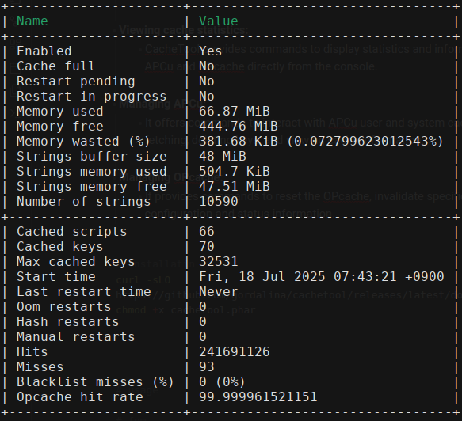

# CacheTool

CacheTool is a command-line interface (CLI) application and library designed to manage various PHP caches, specifically APCu, OPcache, and the file status cache. It provides a convenient way to interact with these caches, particularly when PHP is running as a FastCGI server like PHP-FPM.


- **Clearing caches:** 
	- It allows for clearing the bytecode cache (OPcache) without requiring a restart of PHP-FPM, which is beneficial for deployments or cache invalidation.
    
- **Cache invalidation:** 
	- It can be used in automated scripts or cron jobs to handle cache invalidation based on specific criteria.
    
- **Viewing cache statistics:** 
    - CacheTool provides commands to display statistics and information about the state of APCu and OPcache directly from the console.
    
- **Managing APCu:** 
    - It offers commands to interact with APCu user and system caches, including storing, -fetching, deleting keys, and viewing cache information.
    
- **Managing OPcache:** 
    - It provides commands to reset the OPcache, invalidate specific scripts, and retrieve configuration and status information.

```shell
# installatin
curl -sLO https://github.com/gordalina/cachetool/releases/latest/download/cachetool.phar
chmod +x cachetool.phar
```


```shell
# usage

# fpm
php cachetool.phar apcu:cache:info --fcgi
php cachetool.phar apcu:cache:info --fcgi=127.0.0.1:9000
php cachetool.phar opcache:status --fcgi=/var/run/php/php8.1-fpm.sock

# cli
php cachetool.phar opcache:status --cli
```


<p float="left" align="middle">
  

</p>

