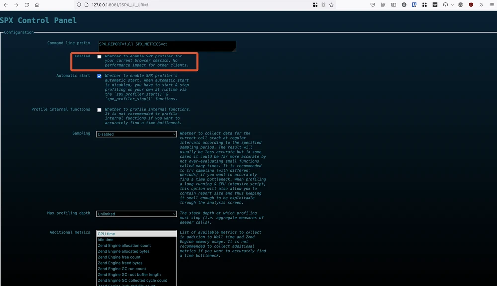
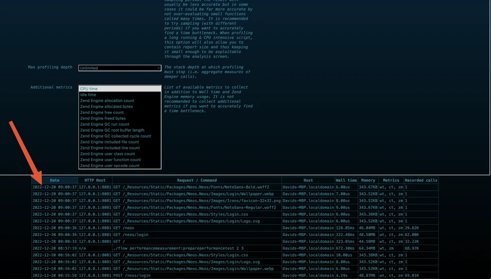
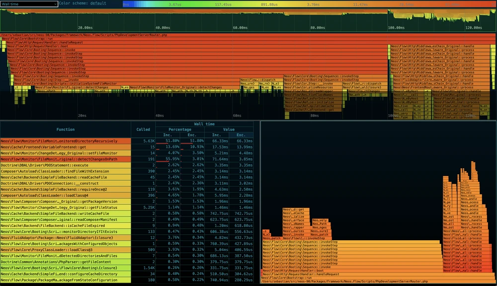
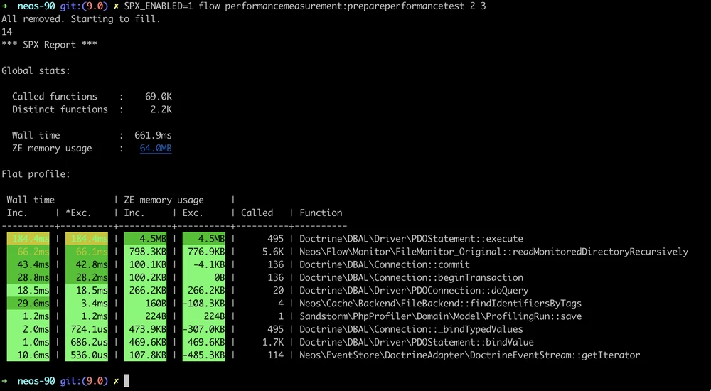

# PHP-SPX

SPX is a profiling extension for PHP that allows you to profile your PHP scripts and get detailed insights into their performance. It differentiates itself from other similar extensions by being totally free, simple to use, and capable of collecting a wide range of metrics. With SPX, you can easily profile your scripts by setting an environment variable or using a web UI, without the need for manually instrumenting your code or using a dedicated browser extension.


```
░█████████  ░██     ░██ ░█████████            ░██████   ░█████████  ░██    ░██ 
░██     ░██ ░██     ░██ ░██     ░██          ░██   ░██  ░██     ░██  ░██  ░██  
░██     ░██ ░██     ░██ ░██     ░██         ░██         ░██     ░██   ░██░██   
░█████████  ░██████████ ░█████████  ░██████  ░████████  ░█████████     ░███    
░██         ░██     ░██ ░██                         ░██ ░██           ░██░██   
░██         ░██     ░██ ░██                  ░██   ░██  ░██          ░██  ░██  
░██         ░██     ░██ ░██                   ░██████   ░██         ░██    ░██                                                                     
```


## Key Features

1. Simple, Self-Hosted Profiling
	- **Zero-Dependency:** No external SaaS service or browser extension required.
	- **Easy Activation:** Can be activated via environment variables (CLI) or a simple toggle in the built-in web UI.
	- **Self-Hosted:** Keeps all profiling data within your own infrastructure, ensuring no sensitive data leaks.
	
2. Powerful Built-in Web UI 
	- **Interactive Visualizations:** Provides a comprehensive UI with support for **Flamegraphs**, **Timelines**, and **Flat Profiles** to identify bottlenecks.
	- **Timeline Analysis:** Allows visualizing call stacks over time, handling up to millions of function calls.
	- **Live Profiling:** Supports live profiling for CLI scripts.
	
3. Detailed Performance Metrics
	- **Multi-Metric Support:** Collects 22+ metrics, including Wall Time, CPU Time, and memory usage.
	- **Resource Tracking:** Tracks Zend Engine memory allocations, free counts, I/O operations (reads/writes), and garbage collector activity.
	- **Context Preservation:** Unlike Xhprof, PHPSPX collects data without losing context, allowing for accurate Flamegraphs, rather than just aggregating by caller/callee.
    
4. Compatibility and Flexibility
	- **Environment Support:** Works with both PHP-FPM (web) and CLI scripts.
	- **Low Overhead:** Designed to have minimal impact on performance.
	- **Production Safety:** While primarily used in development, it can be used for debugging production, provided that access to the web UI is secured via its built-in IP whitelist/key mechanism.
	- **AI Integration:** A new [MCP Server](https://packagist.org/packages/codemonkey/spx-mcp-server) allows using AI to analyze SPX profiles to automatically find slow functions, memory leaks, and N+1 queries.

## Creating and analyzing profiles in web context

 You can use any PHP server (such as the built-in one, or Nginx, or ...) to start the PHP-SPX UI. Simply go to http://your-server-url/?SPX_KEY=dev&SPY_UI_URI=/ to open the web UI:

<p float="left" align="middle">
  
</p>

Now, you can enable profiling for your browser session by switching the "Enabled" toggle (and you can configure lots of other things as well):


<p float="left" align="middle">
  
</p>

After you have executed the web requests you want to profile in your application, you see the list at the bottom of the Profiler UI.


### The Profile Analyzer

When you select one request flow, you get the profile Analyzer UI which looks like the following screenshot.

At the top, you get the timeline sequence of all method calls, at the bottom left a summary table sorted by metrics, and at the bottom right a flame graph for the selected time frame.

**Note:** Make sure to get acquainted with the Analyzer UI, as it is really powerful.

<p float="left" align="middle">
  
</p>

## Creating and analyzing profiles in CLI

You can also analyze CLI requests, by setting **SPX_ENABLED=1**, and optionally, for a live-refreshing mode, set additionally **SPX_FP_LIVE=1**. Then, after the CLI execution, you directly get a profile printed:

```php
SPX_ENABLED=1 SPX_FP_LIVE=1 php your_script.php
```

**Note** : You can use **`SPX_FP_URI`** with **SPX_FP_LIVE** for setting the URL to profile.

<p float="left" align="middle">
  
</p>

By setting **SPX_REPORT=full**, the report will appear in the web UI and can be analyzed in detail:

```php
SPX_ENABLED=1 **SPX_REPORT=full php your_script.php
```


## Configurations

### Enable PHP-SPX Profiling 

To enable PHP SPX within your code scripts, you can use built-in functions to manually control the profiling range or configure it globally through settings. 

#### Manual Profiling in PHP Scripts

If you want to profile only a specific section of your code, use the following functions:


```php
// Start profiling manually
spx_profiler_start();

// Your code to profile goes here
perform_heavy_task();

// Stop profiling manually
spx_profiler_stop();
```

- **Automatic Shut-down**: You can also ensure profiling stops when the script finishes by using a [shutdown function](https://github.com/Automattic/wpenv-with-spx):
    
    ```php
    spx_profiler_start();
    register_shutdown_function('spx_profiler_stop');
    ```

#### Global and Automatic Activation

Instead of modifying your script code, you can enable SPX through environment variables or configuration files, which is often easier for debugging entire requests.

- **Command Line (CLI)**: Prefix your command with the `SPX_ENABLED` environment variable:

    ```bash
    SPX_ENABLED=1 php your_script.php
    ```
    
- **Web Request**: Access your application with the SPX Web UI parameters to enable profiling for that specific browser session:  
    `http://localhost/?SPX_KEY=dev&SPX_UI_URI=/`  
    Once the control panel opens, you can toggle **"Enabled"** and **"Automatic start"** to profile subsequent page reloads.
- **INI Configuration**: To profile _all_ incoming requests globally, set this in your `php.ini` or a dedicated `spx.ini`

    ```bash
    spx.http_profiling_enabled = 1
    ```
    
**Note:** Use this cautiously on high-traffic environments as it can quickly fill up storage with report data.
### Configure the Sampling Period (Profiling Rate)

The sampling period is controlled by the `SPX_SAMPLING_PERIOD` parameter. You can set this via the [PHP `putenv()` function](https://www.php.net/manual/en/function.putenv.php) or by setting it in your web server/shell environment.

Common sampling period values (in microseconds):

- **`500`** (500us): A balanced default for many scripts.
- **`1000`** (1ms): Lower overhead for very long-running processes.
- **`2000`** (2ms) or higher for massive datasets.
    

If you want to profile a specific part of your code (like a loop in a daemon) with sampling enabled, use `spx_profiler_start()` and `spx_profiler_stop()`.


```php
// 1. Configure sampling parameters via environment variables
putenv("SPX_ENABLED=1");
putenv("SPX_REPORT=full");
putenv("SPX_SAMPLING_PERIOD=500"); // Set sampling to 500 microseconds
putenv("SPX_AUTO_START=0");        // Disable auto-start to control via code

// 2. Instrument the specific code block
spx_profiler_start();

try {
    // Your intensive code here
    for ($i = 0; $i < 100000; $i++) {
        compute_something();
    }
} finally {
    // 3. Stop profiling and generate the report
    spx_profiler_stop();
}
```


Key Parameters for Sampling:

When configuring through code via `putenv()` or `ini_set()`, keep these settings in mind:

- **`SPX_SAMPLING_PERIOD`**: The interval (in microseconds) at which the call stack is captured. Setting this to `0` disables sampling and uses standard tracing.
- **`SPX_AUTO_START`**: Set to `0` if you want to use `spx_profiler_start()` to precisely target a code segment.
- **`SPX_REPORT`**: Usually set to `full` to ensure a detailed report is saved to the data directory for the PHP-SPX Web UI.
- -**`SPX_REPORT_DIR`** (Default: `/tmp`): Defines the directory where SPX will store generated report files.


## Profiling ONLY Specific Routes

### Query-based

Disable auto profiling:

```ini
spx.auto_start=0
```

Then trigger profiling only when needed:

```bash
http://localhost:8080/api/users?SPX_KEY=dev&SPX_PROFILE=1
```


### Route-based logic in PHP

Inside `index.php` (or your front controller):  SPX activates automatically for selected routes.

```php
$profileRoutes = [
	'/api/users',
	'/api/orders'
];

$requestUri = parse_url($_SERVER['REQUEST_URI'], PHP_URL_PATH);

if (in_array($requestUri, $profileRoutes)) 
{
    $_GET['SPX_KEY'] = 'dev';
    $_GET['SPX_PROFILE'] = 1;
}
```


### Header-based profiling

This avoids polluting URLs and works great with APIs.

### Update PHP logic:

```php
$profileRoutes = [
	'/api/users',
	'/api/orders'
];

$requestUri = parse_url($_SERVER['REQUEST_URI'], PHP_URL_PATH);
$enableProfiling = in_array($requestUri, $profileRoutes) && isset($_SERVER['HTTP_X_PROFILE']) && $_SERVER['HTTP_X_PROFILE'] === '1';

if ($enableProfiling) 
{
	$_GET['SPX_KEY'] = 'dev';
	$_GET['SPX_PROFILE'] = 1;
}
```

### Trigger with curl:

```bash
curl -H "X-Profile: 1" http://localhost:8080/api/users
```


### Helper Scripts

Create a `scripts/` folder:

```bash
scripts/
├── profile.sh
├── open-spx.sh
```


1. `scripts/profile.sh`

```bash
#!/bin/bash

ROUTE=$1

if [ -z "$ROUTE" ]; then
  echo "Usage: ./scripts/profile.sh /api/users"
  exit 1
fi

echo "Profiling route: $ROUTE"

curl -H "X-Profile: 1" "http://localhost:8080$ROUTE" > /dev/null

echo "Done. Open SPX UI:"
echo "http://localhost:8080/?SPX_KEY=dev&SPX_UI=1"
```


2. `scripts/open-spx.sh`

```bash
#!/bin/bash

xdg-open "http://localhost:8080/?SPX_KEY=dev&SPX_UI=1" 2>/dev/null || \
open "http://localhost:8080/?SPX_KEY=dev&SPX_UI=1"
```

**Note**: You can pair it with other http benchmarking tools like **wrk** to profile realistic traffic

```bash
wrk -H "X-Profile: 1" http://localhost:8080/api/users
```

### k6 + SPX Setup

This is the `k6/script.js`

```js
import http from 'k6/http';
import { sleep } from 'k6';

export let options = {
  vus: 10,
  duration: '20s',
};

const enableProfiling = __ENV.PROFILE === "1";

export default function () {

  // Normal traffic (no profiling)
  http.get('http://localhost:8080/api/users');

  // Sampled profiling traffic (only 1%)
if (enableProfiling && Math.random() < 0.01) {
    http.get('http://localhost:8080/api/users', {
      headers: {
        'X-Profile': '1'
      }
    });
  }

  sleep(1);
}
```

k6 run k6/script.js

```bash
k6 run --env PROFILE=1 k6/script.js
```

- 99% requests → fast, no overhead
- 1% requests → profiled
- You get **real-world flame graphs under load**


## Profile ONLY Slow Requests (> X ms)

1. Measure request time
2. If it exceeds threshold → trigger SPX
3. Restart request with profiling enabled

### Implementation (Front Controller)

```php

$thresholdMs = 200; // profile if > 200ms
$start = microtime(true);

// ---- your app bootstrap ----
// require 'vendor/autoload.php';
// run framework / router here

register_shutdown_function(function () use ($start, $thresholdMs) {

    $durationMs = (microtime(true) - $start) * 1000;
	
    if ($durationMs > $thresholdMs && !isset($_GET['SPX_PROFILE'])) {

        // Avoid infinite loop
        if (isset($_SERVER['HTTP_X_SPX_RETRY'])) {
            return;
        }

        $url = $_SERVER['REQUEST_URI'];
        $separator = strpos($url, '?') !== false ? '&' : '?';

        $redirectUrl = $url . $separator . 'SPX_KEY=dev&SPX_PROFILE=1';

        header('X-SPX-Retry: 1');
        header('Location: ' . $redirectUrl);
    }
});
```

 Important Notes
 
- First request → normal
- If slow → redirected → profiled
- Adds 1 extra request only for slow endpoints

### Header-based retry

Avoid URL pollution:

```php
if ($durationMs > $thresholdMs && empty($_SERVER['HTTP_X_PROFILE'])) {

    header('Location: ' . $_SERVER['REQUEST_URI']);
    header('X-Profile: 1');
}
```

Paired with the above header logic activates SPX.

### Profile ONLY Slow + Sampled

Combine both strategies:

```php
$shouldSample = mt_rand(1, 100) === 1; // 1%  
  
if ($durationMs > 200 && $shouldSample) {  
	$_GET['SPX_KEY'] = 'dev';  
	$_GET['SPX_PROFILE'] = 1;  
}
```


## Makefile (Automation)

Create `Makefile` in root:

```bash
.PHONY: up down build logs shell profile spx

up:
	docker-compose up -d

build:
	docker-compose up --build -d

down:
	docker-compose down

logs:
	docker-compose logs -f

shell:
	docker exec -it php sh

profile:
	@if [ -z "$(route)" ]; then \
		echo "Usage: make profile route=/api/users"; \
	else \
		./scripts/profile.sh $(route); \
	fi

spx:
	./scripts/open-spx.sh
	
k6:  
	k6 run k6/script.js  
  
k6-profile:  
	k6 run --env PROFILE=1 k6/script.js
```


 Usage Examples

1. Start stack

```bash
make up
```

2. Profile a route

```bash
make profile route=/api/users
```

3. Open SPX UI

```bash
make spx
```


**Recommended:** 

Disable auto start:

```
spx.auto_start=0
```

And use:

- Header trigger
- Sampling
- Slow detection


### Automatic Slow Endpoint Detection

We will :
- Runs load tests
- Detects slow endpoints automatically
- Produces a **report (p95, avg, errors)**
- Optionally **fails** if thresholds are exceeded
-  Correlates with SPX profiling

After running **k6**, we’ll get:

```
reports/
├── summary.json
├── slow_endpoints.txt
└── report.md
```

#### k6 Script with Metrics per Endpoint

The metrics we record in `k6/script.js` are : 
- **p99 latency**
- **p95 latency**
- **Error rate**
- **Throughput (RPS)**

```js
import http from 'k6/http';
import { sleep } from 'k6';
import { Trend, Rate, Counter } from 'k6/metrics';

const endpoints = [
  '/api/users',
  '/api/orders',
  '/api/products'
];

// Custom metrics
let trends = {};
let errorRates = {};
let requestCounts = {};

endpoints.forEach(e => {
  const key = e.replace(/\//g, '_');

  trends[e] = new Trend(`trend_${key}`);
  errorRates[e] = new Rate(`error_${key}`);
  requestCounts[e] = new Counter(`count_${key}`);
});

export let options = {
  vus: 10,
  duration: '20s',
};

export default function () {

  endpoints.forEach((endpoint) => {
    const res = http.get(`http://localhost:8080${endpoint}`);

    const key = endpoint.replace(/\//g, '_');

    trends[endpoint].add(res.timings.duration);

    // error = non-2xx/3xx
    const isError = !(res.status >= 200 && res.status < 400);
    errorRates[endpoint].add(isError);

    requestCounts[endpoint].add(1);

    // profiling sampling
    if (__ENV.PROFILE === "1" && Math.random() < 0.01) {
      http.get(`http://localhost:8080${endpoint}`, {
        headers: { 'X-Profile': '1' }
      });
    }
  });

  sleep(1);
}
```

**Export Results (JSON)**

Run k6 with:

```bash
k6 run --summary-export=reports/summary.json k6/script.js
```

#### Slow Endpoint Detection Script

`scripts/analyze.js`

```js
const fs = require('fs');

const data = JSON.parse(fs.readFileSync('reports/summary.json', 'utf-8'));


const THRESHOLD_P95 = 200;
const THRESHOLD_P99 = 400;
const ERROR_RATE_THRESHOLD = 0.01; // 1%
const rps = data.metrics.http_reqs.values.rate;

let results = [];
let slowEndpoints = [];

function extractEndpoint(name) {
  return name.replace(/^(trend|error|count)_/, '').replace(/_/g, '/');
}

const metrics = data.metrics;

Object.keys(metrics).forEach(name => {

  if (!name.startsWith('trend_')) return;

  const endpoint = extractEndpoint(name);

  const trend = metrics[name];
  const error = metrics[`error_${endpoint.replace(/\//g, '_')}`];
  const count = metrics[`count_${endpoint.replace(/\//g, '_')}`];

  const p95 = trend.values['p(95)'];
  const p99 = trend.values['p(99)'];
  const errorRate = error ? error.values.rate : 0;
  const totalRequests = count ? count.values.count : 0;

  results.push({
    endpoint,
    p95,
    p99,
    errorRate,
    totalRequests
  });
});

// Save enriched report
fs.writeFileSync('reports/metrics.json', JSON.stringify(results, null, 2));

// Detect problems
let issues = [];

results.forEach(r => {
  if (r.p95 > THRESHOLD_P95) {
	  issues.push(`${r.endpoint} p95=${r.p95.toFixed(1)}ms`);
	  slowEndpoints.push({  
		name: metricName.replace('trend_', '').replace(/_/g, '/'), p95  
	  });
  }
  if (r.p99 > THRESHOLD_P99) issues.push(`${r.endpoint} p99=${r.p99.toFixed(1)}ms`);
  if (r.errorRate > ERROR_RATE_THRESHOLD) issues.push(`${r.endpoint} errors=${(r.errorRate*100).toFixed(2)}%`);
});

// Markdown report
let md = `# Performance Report

## Thresholds
- p95 > ${THRESHOLD_P95}ms
- p99 > ${THRESHOLD_P99}ms
- error rate > ${ERROR_RATE_THRESHOLD * 100}%

## Results

`;

results.forEach(r => {
  md += `### ${r.endpoint}
- p95: ${r.p95.toFixed(1)} ms
- p99: ${r.p99.toFixed(1)} ms
- error rate: ${(r.errorRate * 100).toFixed(2)} %
- requests: ${r.totalRequests}

`;
});

if (issues.length > 0) {
  md += `## ❌ Issues\n\n`;
  issues.forEach(i => md += `- ${i}\n`);
} else {
  md += `✅ No issues detected\n`;
}
md += `\n## Throughput\n- RPS: ${rps.toFixed(2)}\n`;

fs.writeFileSync('reports/report.md', md);

//slow enspoint
fs.writeFileSync(  
	'reports/slow_endpoints.txt',  
	slowEndpoints.map(e => `${e.name} -> p95=${e.p95.toFixed(2)}ms`).join('\n')  
);

// Exit for CI
if (issues.length > 0) {
  console.error('❌ Performance issues detected');
  process.exit(1);
}
```

### Regression tracking

#### Historical Comparison

- fail on +20% slowdown

```
reports/
├── current.json
├── baseline.json
```

`scripts/compare.js`

```js
const fs = require('fs');

const current = JSON.parse(fs.readFileSync('reports/metrics.json'));
const baseline = JSON.parse(fs.readFileSync('reports/baseline.json'));

const REGRESSION_THRESHOLD = 1.2; // +20%

let regressions = [];

current.forEach(curr => {

  const base = baseline.find(b => b.endpoint === curr.endpoint);
  if (!base) return;

  const p95Ratio = curr.p95 / base.p95;
  const p99Ratio = curr.p99 / base.p99;

  if (p95Ratio > REGRESSION_THRESHOLD) {
    regressions.push(`${curr.endpoint} p95 regression +${((p95Ratio-1)*100).toFixed(1)}%`);
  }

  if (p99Ratio > REGRESSION_THRESHOLD) {
    regressions.push(`${curr.endpoint} p99 regression +${((p99Ratio-1)*100).toFixed(1)}%`);
  }
});

if (regressions.length > 0) {
  console.error('❌ Regressions detected:');
  regressions.forEach(r => console.error(r));
  process.exit(1);
} else {
  console.log('✅ No regressions');
}
```

#### Slack Alerts on Regression

1. Create Incoming Webhook

In **Slack**:

- Go to: _Apps → Incoming Webhooks_
- Create webhook
- Copy URL like:

```
https://hooks.slack.com/services/XXX/YYY/ZZZ
```

2. `scripts/slack.js`

```js
const fs = require('fs');
const axios = require('axios');

const webhook = process.env.SLACK_WEBHOOK;

if (!webhook) {
  console.error('Missing SLACK_WEBHOOK');
  process.exit(1);
}

const current = JSON.parse(fs.readFileSync('reports/metrics.json'));
const baseline = JSON.parse(fs.readFileSync('reports/baseline.json'));

const THRESHOLD = 1.2;

let blocks = [];

current.forEach(curr => {

  const base = baseline.find(b => b.endpoint === curr.endpoint);
  if (!base) return;

  const ratio = curr.p95 / base.p95;

  if (ratio > THRESHOLD) {

    blocks.push({
      type: "section",
      text: {
        type: "mrkdwn",
        text:
`❌ *Regression detected*
Endpoint: \`${curr.endpoint}\`
p95: ${curr.p95.toFixed(1)}ms (was ${base.p95.toFixed(1)}ms)
Increase: +${((ratio - 1) * 100).toFixed(1)}%`
      }
    });

  }
});

if (blocks.length === 0) {
  console.log('No regressions → no Slack alert');
  process.exit(0);
}

axios.post(webhook, {
  text: "Performance Regression Alert",
  blocks
})
.then(() => console.log('✅ Slack alert sent'))
.catch(err => console.error(err));
```

3. Add to Makefile

```
slack:	
	SLACK_WEBHOOK=$(SLACK_WEBHOOK) node scripts/slack.js
```

4. Usage

```
SLACK_WEBHOOK=https://hooks.slack.com/services/... make slack
```

5. Example Slack Message

```
❌ Regression detected
Endpoint: /api/users
p95: 320ms (was 210ms)
Increase: +52%
```

### Makefile Integration

We can extend the above Makefile:

```bash
.PHONY: perf analyze report

perf:
	mkdir -p reports
	k6 run --summary-export=reports/summary.json k6/script.js

analyze:
	node scripts/analyze.js
	
baseline:  
	cp reports/metrics.json reports/baseline.json

report: perf analyze
	@echo "Report generated in reports/"
	
full: report compare

slack:	
	SLACK_WEBHOOK=$(SLACK_WEBHOOK) node scripts/slack.js
```

**Usage**

1. First Run (create baseline)

```bash
make report
make baseline
```

2. Next runs (detect regressions)

```bash
make full
```

3. Output example

	- **Terminal:**

```bash

mkdir -p reports
k6 run --summary-export=reports/summary.json k6/script.js

     execution: local
        script: k6/script.js
        output: -

     scenarios: (100.00%) 1 scenario, 10 max VUs, 20s max duration

     ✓ status is 200

     checks.........................: 100.00% ✓ 1200 ✗ 0
     http_reqs......................: 1200   60.00/s
     http_req_duration..............: avg=145ms p(95)=280ms p(99)=520ms

running (20.0s), 00/10 VUs, 1200 complete

node scripts/analyze.js

❌ Performance issues detected

node scripts/compare.js

❌ Regressions detected:
/api/users p95 regression +35.2%
/api/users p99 regression +48.7%

make: *** [compare] Error 1
```

 - `reports/report.md`
 
```markdown
# Performance Report

## Thresholds
- p95 > 200ms
- p99 > 400ms
- error rate > 1%

## Results

### /api/users
- p95: 320.4 ms
- p99: 610.2 ms
- error rate: 0.00 %
- requests: 400

### /api/orders
- p95: 150.1 ms
- p99: 220.5 ms
- error rate: 0.00 %
- requests: 400

### /api/products
- p95: 120.3 ms
- p99: 180.7 ms
- error rate: 0.00 %
- requests: 400

## Throughput
- RPS: 60.00

## ❌ Issues

- /api/users p95=320.4ms
- /api/users p99=610.2ms
```

- `reports/metrics.json`

```json
  {
    "endpoint": "/api/users",
    "p95": 320.4,
    "p99": 610.2,
    "errorRate": 0,
    "totalRequests": 400
  }
]
```

### HTML Dashboard

We generate a static dashboard using **Chart.js**

1. `scripts/generate-dashboard.js`
```js
const fs = require('fs');

const metrics = JSON.parse(fs.readFileSync('reports/metrics.json'));
const timestamp = new Date().toISOString();

const html = `
<!DOCTYPE html>
<html>
<head>
  <title>Performance Dashboard</title>
  <script src="https://cdn.jsdelivr.net/npm/chart.js"></script>
  <style>
    body { font-family: Arial; padding: 20px; }
    .card { margin-bottom: 30px; }
  </style>
</head>
<body>

<h1>🚀 Performance Dashboard</h1>
<p>Generated at: ${timestamp}</p>

<div class="card">
  <canvas id="latencyChart"></canvas>
</div>

<div class="card">
  <canvas id="errorChart"></canvas>
</div>

<script>
const data = ${JSON.stringify(metrics)};

const labels = data.map(d => d.endpoint);

const p95 = data.map(d => d.p95);
const p99 = data.map(d => d.p99);
const errors = data.map(d => d.errorRate * 100);

new Chart(document.getElementById('latencyChart'), {
  type: 'bar',
  data: {
    labels,
    datasets: [
      { label: 'p95 (ms)', data: p95 },
      { label: 'p99 (ms)', data: p99 }
    ]
  }
});

new Chart(document.getElementById('errorChart'), {
  type: 'bar',
  data: {
    labels,
    datasets: [
      { label: 'Error %', data: errors }
    ]
  }
});
</script>

</body>
</html>
`;

fs.writeFileSync('reports/dashboard.html', html);
console.log('✅ Dashboard generated: reports/dashboard.html');
```


2. Add to makefile
```bash
dashboard:
	node scripts/generate-dashboard.js
```


### Auto-Link SPX Profiling

#### Full Triggering on slow endpoints 

We connect this with SPX For each slow endpoint, re-profile it automatically

1. `scripts/profile-slow.sh`

```bash
#!/bin/bash

FILE="reports/slow_endpoints.txt"

if [ ! -f "$FILE" ]; then
  echo "No slow endpoints file found"
  exit 1
fi

while read -r line; do
  route=$(echo $line | cut -d ' ' -f1)

  echo "Profiling $route..."

  curl -H "X-Profile: 1" "http://localhost:8080$route" > /dev/null

done < "$FILE"

echo "Open SPX UI:"
echo "http://localhost:8080/?SPX_KEY=dev&SPX_UI=1"
```

2. Add to Makefile:

```bash
profile-slow:	
	./scripts/profile-slow.sh
```

#### Auto-trigger SPX ONLY for Regressed Endpoints

We connect this with SPX For only the regressed slow endpoint, re-profile it automatically

1. `scripts/get-regressions.sh`

```bash
#!/bin/bash

FILE="reports/metrics.json"
BASE="reports/baseline.json"

if [ ! -f "$FILE" ] || [ ! -f "$BASE" ]; then
  echo "Missing metrics or baseline"
  exit 1
fi

echo "🔍 Profiling regressed endpoints..."

node <<EOF
const fs = require('fs');

const current = JSON.parse(fs.readFileSync('$FILE'));
const baseline = JSON.parse(fs.readFileSync('$BASE'));

const THRESHOLD = 1.2;

current.forEach(curr => {
  const base = baseline.find(b => b.endpoint === curr.endpoint);
  if (!base) return;

  const ratio = curr.p95 / base.p95;

  if (ratio > THRESHOLD) {
    console.log(curr.endpoint);
  }
});
EOF
```

2. Pipe it into curl `scripts/profile-regressions.sh`

```bash
#!/bin/bash

for route in $(node scripts/get-regressions.js); do
  echo "Profiling $route"
  curl -H "X-Profile: 1" "http://localhost:8080$route" > /dev/null
done

echo "👉 Open SPX UI:"
echo "http://localhost:8080/?SPX_KEY=dev&SPX_UI=1"
```

3. Add to makefile

```bash
profile-regressions:
	./scripts/profile-regressions.sh
```


## Prometheus + Grafana (Live Dashboards)

1. Architecture

```
PHP app → Prometheus exporter → Prometheus → Grafana
```

2. docker-compose (add services)

```yaml
prometheus:
  image: prom/prometheus
  ports:
    - "9090:9090"
  volumes:
    - ./monitoring/prometheus.yml:/etc/prometheus/prometheus.yml

grafana:
  image: grafana/grafana
  ports:
    - "3000:3000"
```

3. `monitoring/prometheus.yml`
```yaml 
global:
  scrape_interval: 5s

scrape_configs:
  - job_name: 'php-app'
    static_configs:
      - targets: ['php:9500']
```

4. Expose Metrics from PHP (promphp/prometheus_client_php)

```php
use Prometheus\CollectorRegistry;
use Prometheus\Storage\InMemory;

$registry = new CollectorRegistry(new InMemory());

$histogram = $registry->getOrRegisterHistogram(
    'app',
    'request_duration_seconds',
    'Request duration',
    ['endpoint']
);

$counter = $registry->getOrRegisterCounter(
    'app',
    'requests_total',
    'Total requests',
    ['endpoint', 'status']
);

$start = microtime(true);

// handle request...

$duration = microtime(true) - $start;

$endpoint = $_SERVER['REQUEST_URI'];
$status = http_response_code();

$histogram->observe($duration, [$endpoint]);
$counter->inc([$endpoint, $status]);
```

5. Expose `/metrics`
```php 
header('Content-Type: text/plain');
echo $registry->getMetricFamilySamples();
```

 5. Grafana Dashboards

Open:

- Grafana: http://localhost:3000
- Prometheus: http://localhost:9090

Add panels:

🔹 Latency (p95 / p99)

```promql
histogram_quantile(0.95, sum(rate(app_request_duration_seconds_bucket[1m])) by (le, endpoint))
```

```promql
histogram_quantile(0.99, sum(rate(app_request_duration_seconds_bucket[1m])) by (le, endpoint))
```

🔹 Error rate

```promql
sum(rate(app_requests_total{status!~"2.."}[1m])) /sum(rate(app_requests_total[1m]))
```


🔹 Throughput (RPS)

```promql
sum(rate(app_requests_total[1m]))
```


 6. Auto-trigger SPX from Live Metrics

 Use Prometheus alerting

-  Alert rule

```yaml
groups:
- name: performance
  rules:
  - alert: HighLatency
    expr: histogram_quantile(0.95, sum(rate(app_request_duration_seconds_bucket[1m])) by (le, endpoint)) > 0.3
    for: 1m
    labels:
      severity: warning
```

- Webhook → SPX trigger

Create a small webhook service: When alert fires → automatically profile endpoint

```
curl -H "X-Profile: 1" http://php/api/users
```
