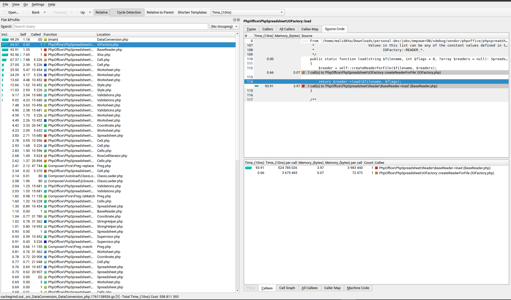
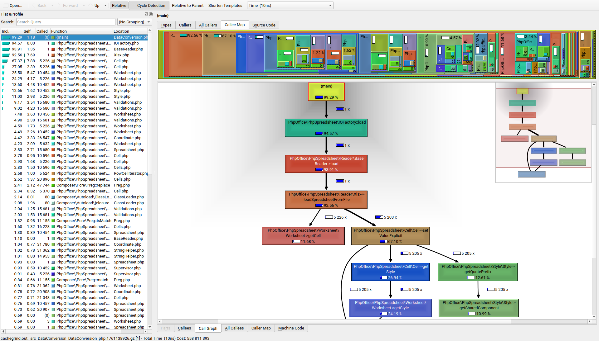
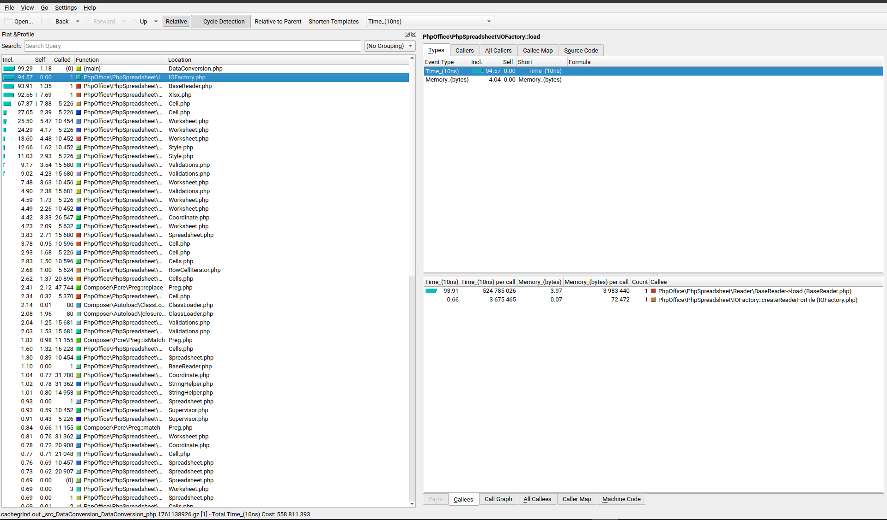
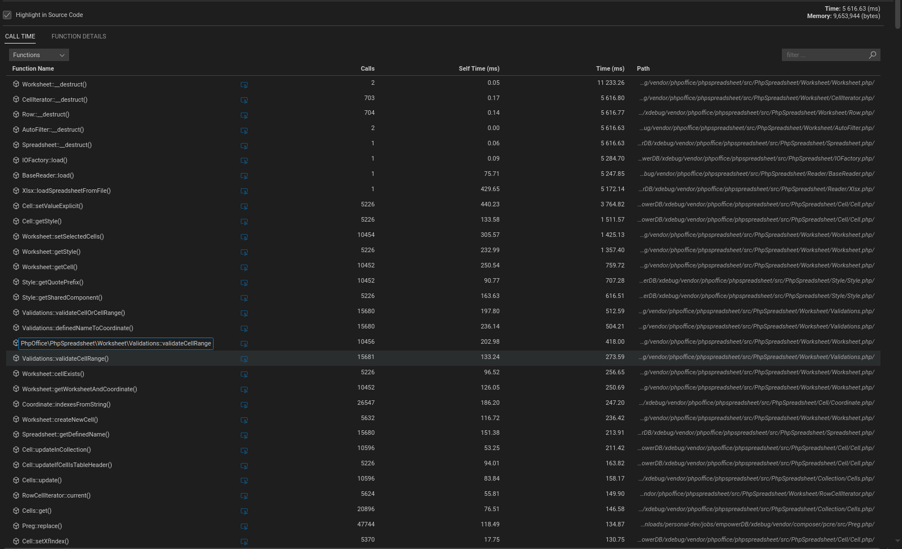
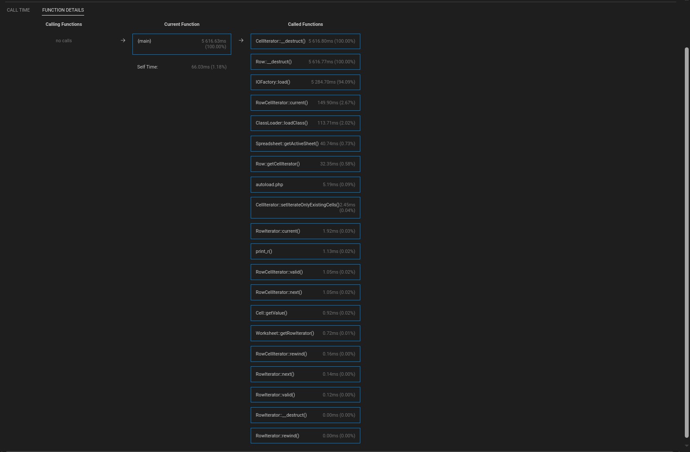
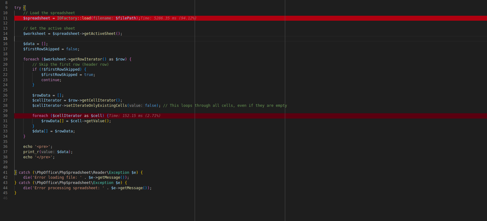

# PHP Xdebug Profiler

Profiling is the first step when optimizing any application. Profiling tools record important details like the time it takes for statements and functions to execute, the number of times they are called, and so on. The output can be analyzed to understand where the bottlenecks are.


## Table Of Contents

- **[PHP Xdebug Profiler](#php-xdebug-profiler)**
   * **[Xdebig Profiler ](#xdebig-profiler)**
      + **[Configurations](#configurations)**
   * **[Visualizing and Analyzing Profiling Data](#visualizing-and-analyzing-profiling-data)**
      + **[KCachegrind](#kcachegrind)**
      + **[VSCode](#vscode)**
      + **[Interpreting Results](#interpreting-results)**


## Xdebig Profiler 

Xdebug's profiler is a tool for analyzing PHP code performance. It helps identify bottlenecks and slow areas within a PHP script by collecting detailed information about function calls, execution times, and memory usage.

### Configurations

```ini
# 99-xdebug.ini
zend_extension=xdebug.so
xdebug.mode=profile
xdebug.output_dir = /tmp/xdebug_profiles  
xdebug.profiler_output_name = cachegrind.out.%R.%t
#xdebug.log=/var/log/xdebug.log
```

- **Output Settings:** 
	- By default, requests end up in the `/tmp` directory. The files begin with `cachegrind.out.` and are suffixed with the process ID.
	- Define the output directory and filename format for profiling data. The default filename often uses the process ID, but you can customize it to include timestamps, request URIs, etc. (e.g., `%R` for request URI, `%t` for timestamp).


## Visualizing and Analyzing Profiling Data

### KCachegrind

`KCachegrind` is a powerful visualization tool used to analyze profiling data, particularly helpful for optimizing PHP applications when combined with Xdebug.

- **KCachegrind Visualization:** KCachegrind then loads these `cachegrind.out` files. It provides various graphical and tabular views to help identify performance bottlenecks:
    - **Call Graph:** A visual representation of function calls, showing the relationships and the time spent in each function. Thicker arrows often indicate more time-consuming calls.
    - **Callers/Callees:** Detailed lists showing which functions called a selected function and which functions it called in turn, along with their respective inclusive and self-times.
    - **Source Code View:** Displays the source code of functions with execution times annotated on each line, allowing for precise identification of slow code sections.
    - **Treemap:** A hierarchical visualization where the size of rectangles represents the time spent in functions or files.

Key metrics in `KCachegrind`:
- **Inclusive Time (Incl.):**  The total time spent in a function, including the time spent in any functions it calls.
- **Self Time (Self):**  The time spent directly within a function, excluding the time spent in functions it calls.


1. install `KCachegrind`

```shell
sudo apt install kcachegrind
```

2. Open KCachegrind
	- Launch KCachegrind from your application menu or by typing kcachegrind in the terminal. 

3. Load the profile
	-  In KCachegrind, go to File > Open and select the profile file you generated in the previous step.


<p float="left" align="middle">
  
  
  
</p>


### VSCode

You can use VSCode to visualize and analyze the Xdebug profiling data all from within the IDE
- **PHP Profiler (DEVSENSE.profiler-php-vscode):** This extension is recommended for analyzing Xdebug profiler data directly within VS Code.


Open the generated `cachegrind.out.*.gz` file directly in VS Code 
- by dragging and dropping it
- or by using the command palette (`Open Profile File (Xdebug Profiling Output)`)
 
This extension provides a visual representation of call times, self-times, and call graphs, allowing you to identify performance bottlenecks.

- **Inspecting Call Times** : lists all the functions with the number of calls (_Calls_), time spent by the function body (_Self Time_), and time including nested calls (_Time_).

- **Inspecting Callers/Callees** : The **Function Details** view is focused on a single function; and displays all the calling functions and all the called functions, including the time information.

- **Highlighting Hot Paths** : The loaded profiling result file is analyzed, and hot paths are highlighted directly in the source code. Highlighting can be turned off in the profiling result view. 

<p float="left" align="middle">
  
  
  
</p>

### Interpreting Results

These tools present the profiling data in a user-friendly format, typically including:

- **Call Graph:** A visual representation of function calls and their execution times.
- **Function List:** A table showing functions, their invocation counts, total execution time (inclusive and self), and memory usage.
- **Hot Path:** Identifies the sequence of function calls that consume the most time.
- **Source Code View:** Allows inspection of execution times per line of code within a function.

 By analyzing the profiling data, you can identify functions or code sections that consume excessive time or memory. This information guides optimization efforts, such as refactoring inefficient code, optimizing database queries, or reducing redundant operations.