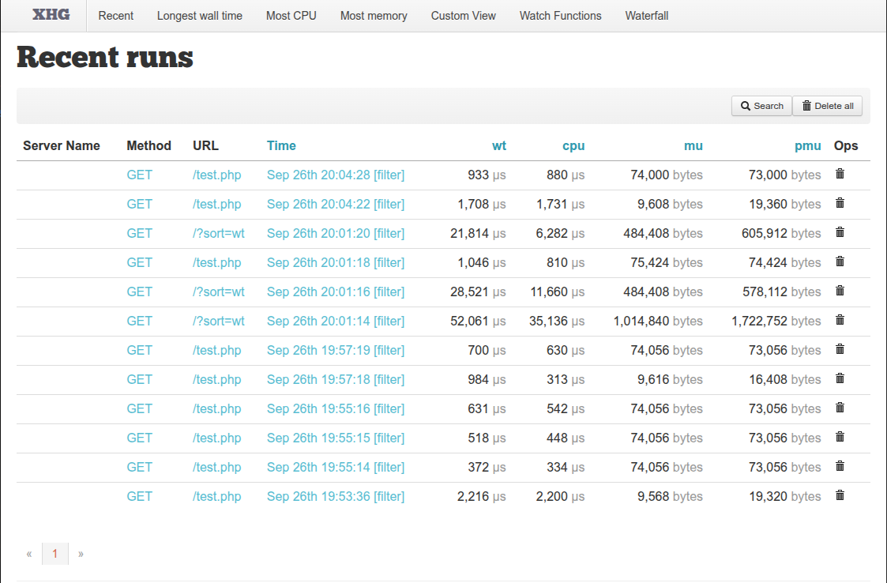

# XHProf

XHProf is a hierarchical, function-level profiler for PHP applications that collects data on function calls, CPU time, and memory usage to help identify performance bottlenecks. It works as a PHP extension to provide raw data collection and includes a simple HTML-based user interface for visualizing results, making it easier to understand code structure and compare different runs.

```
██╗  ██╗██╗  ██╗██████╗ ██████╗  ██████╗ ███████╗
╚██╗██╔╝██║  ██║██╔══██╗██╔══██╗██╔═══██╗██╔════╝
 ╚███╔╝ ███████║██████╔╝██████╔╝██║   ██║█████╗  
 ██╔██╗ ██╔══██║██╔═══╝ ██╔══██╗██║   ██║██╔══╝  
██╔╝ ██╗██║  ██║██║     ██║  ██║╚██████╔╝██║     
╚═╝  ╚═╝╚═╝  ╚═╝╚═╝     ╚═╝  ╚═╝ ╚═════╝ ╚═╝     
```
## Key Features

- **Function-Level Profiling:**  XHProf tracks metrics for each function during program execution, providing detailed insights into how different parts of your code are performing. 
    
- **Hierarchical Data:**  It presents data in a tree-like structure, allowing you to see how a particular function's execution time is broken down among its child functions and what chain of calls led to its execution. 
    
- **Key Metrics:**  XHProf collects information on:
    - **Call Counts:** The number of times a function is called. 
    - **Wall Time (Inclusive/Exclusive):** The total time spent in a function (inclusive) and the time spent only in that function's code, excluding its children (exclusive)
	    - = Elapsed time: if you perform a network call, that's the CPU time to call the service and parse the response, plus the time spent waiting for the I/O
    - **CPU Time:** The processor time used by the function ( CPU time in both kernel and user space). 
    - **Memory Usage:** The memory consumed by the function. 
    
- **Low Overhead:** Implemented as a C-based PHP extension, XHProf is designed for low overhead, minimizing its impact on application performance. 
    
- **User Interface:**  A simple HTML-based UI is included, and you can also use external tools like **XHGui** to view the profiling results. 
    
- **Comparison and Aggregation:**  It supports comparing different profiling runs to find performance changes or aggregating data from multiple runs


The original XHProf extension `phacility/xhprof`has been forked to `longxinH/xhprof` with `PHP 7 & 8` support based on a completely rewritten code-base for less overhead.

**Note** : `longxinH/xhprof` only support PHP >= 7.2 , <= 8.2 (currently), if using an older version consider the original extension `phacility/xhprof`


## XHProf Default UI

Check the docker-compose in the `default-ui` folder, the profiling data is stored in `/profiles` inside the container, not persisted on the host (consider adding a volume for it if needed)
The profiling data is displayed for each php script run

<p float="left" align="middle">
  
   
</p>

**Note** : For using this Graph we need install extension that calls: graphviz. (included in the docker-file)

## XHGUI

We can use XHGUI either by downloading the repository `perftools/xhgui` or using its docker image.

Xhgui needs the data collector `perftools/php-profiler` && `perftools/xhgui-collector` , you can generate the data for both `php-cli` and `php-fpm`

**Note** : Be aware of the directive `open_basedir` when using xhgui for collecting data

**Note 2** : the file `/var/www/xhgui/vendor/perftools/xhgui-collector/src/Xhgui/Saver/Pdo.php` can result on sql errors => replace `` "%s" => `%s` `` and the GET column name with `` `GET` ``

<p float="left" align="middle">
   
</p>


**Note 3** : Add indexes to the database to improve performance. (`results` table)

```shell
# consider adding index on the following columns

# url
# SERVER
# main_wt, main_mu, main_cpu
```


<p float="left" align="middle">
  
   
</p>


<p float="left" align="middle">
  
   
</p>


## Configure Profiling Rate

#### XHProf
 You can save a XHProf run every 100 runs instead of every run
```php 

# xhprof_header.php
$xhprof_on = false; 
if (mt_rand(1, 100) === 1) { 
	$xhprof_on = true; 

	if (extension_loaded('xhprof')) { 
		xhprof_enable(XHPROF_FLAGS_CPU + XHPROF_FLAGS_MEMORY); } 
	}
}

# xhprof_footer.php
if($xhprof_on){
	$data = xhprof_disable();
	file_put_contents(
      "/profiles/" . uniqid() . ".malidkha.xhprof",
      serialize($data)
	);
}

```


#### XHGUI

You may want to do change how frequently you profile the host application. The `profiler.enable` configuration option allows you to provide a callback function that specifies the requests that are profiled. By default, XHGui profiles 1 in 100 requests.

The following example configures XHGui to only profile requests from a specific URL path:

The following example configures XHGui to profile 1 in 100 requests, excluding requests with the `/malidkha URL path:


```php 
# config/config.php
return array(
    // Other config
    /// ........
    
    #1 out of 100 is the default rate
    'profiler.enable' => function() {
        $url = $_SERVER['REQUEST_URI'];
        if (strpos($url, '/malidkha') === 0) {
            return false;
        }
        return rand(1, 100) === 1;
    }
    
    //--------------------------------------------------------
    
    # for every request rate
	'profiler.enable' => function() {
        return true;
    }
```
    
);