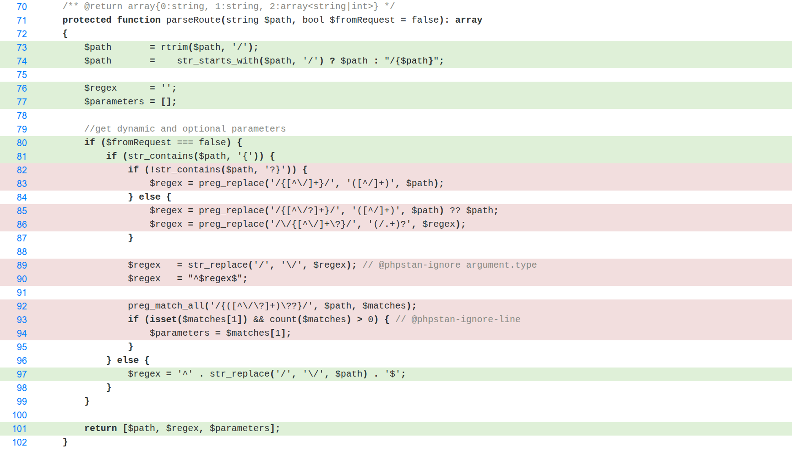

# PHPUnit

PHPUnit is a robust and widely used testing framework designed specifically for PHP. It allows developers to perform unit testing by providing a structured and efficient way to test individual code units. As an implementation of the xUnit architecture, PHPUnit is tailored to suit the needs of PHP developers, making it straightforward to set up and begin testing.


# PHPUnit

## Key features

- **Unit testing**:  PHPUnit is primarily used to test individual "units" of code, such as functions or methods, to check their output against expected results. 
    
- **xUnit architecture**:  It is based on the xUnit architecture, a pattern for creating unit testing frameworks that originated with SUnit and was popularized by JUnit. 
    
- **Assertions**: It provides a collection of simple and flexible assertions that allow you to easily test if your code's output matches the expected value. 
    
- **Test doubles**: It supports the use of test doubles, such as stubs and mocks, to test code in isolation by replacing dependencies with fake objects. 
    
- **Data providers**: You can use data providers to test a single test method with different sets of data, which simplifies testing functionality against various inputs. 
    
- **Integration testing:** While primarily known for unit testing, can also be utilized for integration testing in PHP applications. Integration testing, in contrast to unit testing, focuses on verifying the interactions and communication between different components or modules of a system, or between the system and external dependencies like databases or APIs.
	- **Simulate Real Interactions:**  Instead of mocking all dependencies, integration tests aim to use real dependencies where possible to truly test the integration. For example, if testing a database interaction, the test would connect to the actual test database.

## Setting Up

1. Installation 

```shell
composer require --dev phpunit/phpunit
```

2. Using PSR-4 for autoloading

```json
{
    "require": {
    },
    "require-dev": {
        "phpunit/phpunit": "^11.5"
    },
    "autoload": {
        "psr-4": {
            "Malidkha\\Tests\\": "tests/"
        }
    }
}
```

3. Configuring PHPUnit - phpunit.xml

```xml

<?xml version="1.0" encoding="UTF-8"?>
<phpunit colors="true">
    <testsuites>
        <testsuite name="Application Unit Test Suite">
            <directory>./tests/Unit/</directory>
        </testsuite>
    </testsuites>
</phpunit>
```

4. Running the tests

```shell
./vendor/bin/phpunit
```


## Tests writing

### Definitions, naming, conventions

1. Test class — PHP class that contain tests for some functionality. Test class name must have “Test” postfix. Mostly uses one test class for one class, and named test class as original class name plus “Test” postfix.
2. Every test class mostly extends `PHPUnit\Framework\TestCase.`
3. Test method — it is a methods in test classes that contain functionality test. Test method name should have “test” prefix or must be marked with @test annotation or #[Test] attribute. Methods must be public.
4. For better convenience, the structure of the test directories should follow the structure of our class directories.

```php
public function testSimpleAssert(): void
{
    Assert::assertEquals(1, 1, 'Number "one" not aquals to number "one"');
}
```

## Asserts

```php
//Asserts that two variables have the same type and value. Used on objects, it asserts that two variables reference the same object.
assertSame($expected, $actual, string $message = '')

//Asserts that two variables do not have the same type and value. Used on objects, it asserts that two variables do not reference the same object.
assertNotSame($expected, $actual, string $message = '')

// Asserts that two variables are equal.
assertEquals($expected, $actual, string $message = ''): void

// Asserts that two variables are not equal.
assertNotEquals($expected, $actual, string $message = ''): void

// Asserts that a variable is null.
public static function assertNull($actual, string $message = ''): void

// Asserts that a variable is not null.
assertNotNull($actual, string $message = ''): void

// Asserts that a variable is of a given type.
assertInstanceOf(string $expected, $actual, string $message = ''): void

// Asserts that a condition is true.
assertTrue($condition, string $message = ''): void

// Asserts that a condition is false.
assertFalse($condition, string $message = ''): void

// Asserts the number of elements of an array, Countable or Traversable.
assertCount(int $expectedCount, $haystack, string $message = ''): void

// Asserts that an array has a specified key.
ssertArrayHasKey($key, $array, string $message = ''): void

// Asserts that a haystack contains a needle.
assertContains($needle, iterable $haystack, string $message = ''): void
```

### Tips

If we don’t want to write test body with some assertions we can use mark test as incomplete.

```php
public function testSomeFunctionality(): void
{
	$this->markTestIncomplete();
}
```

PHPUnit have other “mark” methods:

```php
$this->markTestSkipped();
$this->markAsRisky();
```

### Data providers

We can run test case many times with some arguments:

1. Add annotation @dataprovide dataProviderMethod or attribute
#[DataProvider(’dataProviderMethod’)] for our test case.

```php
/** @dataProvider dataProviderMethod */
public function testSimpleAssert($arg1, $arg2): void
{
    Assert::assertEquals($arg1, $arg2);
}
```

2. Create dataProvideMethod

```php
public function dataProviderMethod(): \Generator
{
    yield 'argument descriptions' => ['val1', 'val2'];
    yield 'yet another argument descriptions' => ['val_1', 'val_2'];
}
```

### Tests doubles

PHPUnit test doubles are objects that stand in for real dependencies during unit testing, allowing for isolated testing of a specific component (System Under Test, SUT) without relying on or triggering the behavior of its external dependencies. This helps to speed up tests and ensure that the SUT's behavior is correctly assessed.

PHPUnit provides mechanisms to create various types of test doubles, primarily **stubs** and **mocks**

#### Stubs

**Stubs:** Stubs are simplified test doubles that provide predefined responses to method calls. They are used when the test needs to control the return values of a dependency's methods, but doesn't need to verify interactions with that dependency. PHPUnit's `createStub()` method is used to create stubs.

- **Purpose:** Stubs are primarily used for state-based testing. Their main goal is to provide specific, pre-programmed responses to method calls, allowing the tested code to proceed without interacting with the real dependency. They simulate predictable outcomes.
    
- **Functionality:**  Stubs typically focus on defining return values for specific method calls. They do not track interactions or verify if certain methods were called.
    
- **Example:** If your code under test depends on a database connection to fetch data, a stub for the database connection would simply return a predefined dataset when a `fetch` method is called, without actually connecting to a database.

```php
    $stub = $this->createStub(DependencyClass::class);
    $stub->method('someMethod')->willReturn('expected_value');

    // Now, when your SUT calls someMethod on the stub, it will return 'expected_value'
```

#### Mocks

A mock object is a simulated object that mimics the behavior of a real object in a **controlled way**. It is a placeholder that stands in for the actual object being tested, providing a simplified and predictable version of its behavior.

- **Purpose:**  Mocks are used for behavior-based testing. They not only provide pre-programmed responses like stubs but also allow you to define and verify expectations about how the object under test interacts with its dependencies.
    
- **Functionality:**     
    - If a specific method was called.
    - How many times a method was called.
    - The order in which methods were called.
    - The arguments passed to a method.
    
- **Example:**  If your code under test is expected to call a `save` method on a repository object, a mock for the repository would allow you to assert that the `save` method was indeed called, and potentially with the correct data, during the test.

Mock objects are often used in unit testing to isolate and test specific parts of a system without having to rely on the functionality of other, external components. By creating a mock object, developers can simulate the behavior of a real object and ensure that their code is working as intended without having to deal with the complexities of the real object.

Recommended to mock only services not a value objects (object used as arguments for method calling).

```php
$mockMethodResult = ResultClass::create(10);
$mockObject = $this->createMock(ClassOrInterface::class);
$mockObject
		->expects(self::once()) // Expect method will be calling ones during test case
		->method('objectMethod') // Mock method calling objectMethod()
		->with('argument', ['a1' => 100], 'lastArgument') // With arguments
		->willReturn($mockMethodResult) // Will return $mockMethodResult object
;
```

Method calling expectations can be:

```php
self::any() //method should calls any times
self::never() //method should not call 
self::atLeast(10) //method should calls at least 10 times
self::atLeastOnce() //method should calls at least one time
self::once() //method should call one time
self::exacly(10) //method should call 10 times
self::atMost(100) //method should at most 100 times
```


**When to Use Test Doubles:**

- The real object is too slow (for example, a database).
- The real object involves external APIs.
- The real object has unpredictable behavior (for example, random data or system time).

### Exceptions test

Before method that throwing exceptions add expectations

```php
$this->expectException(Exceprion::class); //Expected exception class
$this->expectExceptionMessage('Exceprions message'); //expected excepion message
$this->expectExceptionMessageMatches('/Expression.*/i');
$this->expectExceptionCode(1221); //expected exception code (integer)
```

### Test Fixtures 

Test fixtures establish the necessary environment and state for a test or a group of tests. This includes setting up objects, database connections, files, or any other resources required for the test to run correctly.

Fixtures are typically managed using methods like `setUp()` and `tearDown()` within a test class. 
- `setUp()`:  This method is called before each individual test method within a test class. It is used to initialize resources or set up the environment required for a specific test.
    
- `tearDown()`:  This method is called after each individual test method within a test class. It is used to clean up resources or revert changes made during a specific test, ensuring isolation between tests.

```php
class MyTest extends \PHPUnit\Framework\TestCase
{
    protected $someResource;

    protected function setUp(): void
    {
        // Initialize a resource before each test
        $this->someResource = new SomeResource();
    }

    protected function tearDown(): void
    {
        // Clean up the resource after each test
        unset($this->someResource);
    }

    public function testSomething(): void
    {
        // ... use $this->someResource ...
    }

    public function testAnotherThing(): void
    {
        // ... use $this->someResource ...
    }
}
```


- `setUpBeforeClass()`:  This static method is called once before the first test method in a test class is executed. It is ideal for setting up resources that can be shared across all tests in that class, such as a database connection or a shared object.
    
- `tearDownAfterClass()`:  This static method is called once after the last test method in a test class has finished executing. It is used to clean up resources that were set up in `setUpBeforeClass()`.

```php
class MyClassWideTest extends \PHPUnit\Framework\TestCase
{
    protected static $dbConnection;

    public static function setUpBeforeClass(): void
    {
        // Establish a database connection once for all tests in this class
        self::$dbConnection = new PDO('sqlite::memory:');
    }

    public static function tearDownAfterClass(): void
    {
        // Close the database connection after all tests in this class are done
        self::$dbConnection = null;
    }

    public function testDatabaseInteraction(): void
    {
        // ... use self::$dbConnection ...
    }
}
```


### Code Coverage


Code coverage is the percentage of code executed during test runs. It provides insights into untested parts of an application, helping teams enhance test quality and maintainability. The key coverage metrics include:

- **Line Coverage**

> The _Line Coverage_ software metric measures whether each executable line was executed.

- **Branch Coverage**

> The _Branch Coverage_ software metric measures whether the boolean expression of each control structure evaluated to both `true` and `false` while running the test suite.

- **Path Coverage**

> The _Path Coverage_ software metric measures whether each of the possible execution paths in a function or method has been followed while running the test suite. An execution path is a unique sequence of branches from the entry of the function or method to its exit.

- **Function and Method Coverage**

> The _Function and Method Coverage_ software metric measures whether each function or method has been invoked. php-code-coverage only considers a function or method as covered when all of its executable lines are covered.

- **Class and Trait Coverage**

> The _Class and Trait Coverage_ software metric measures whether each method of a class or trait is covered. php-code-coverage only considers a class or trait as covered when all of its methods are covered.

- **Change Risk Anti-Patterns (CRAP) Index**

> The _Change Risk Anti-Patterns (CRAP) Index_ is calculated based on the **cyclomatic complexity** and code coverage of a unit of code. Code that is not too complex and has an adequate test coverage will have a low CRAP index. The CRAP index can be lowered by writing tests and by refactoring the code to lower its complexity.

**Cyclomatic complexity** indicates how complex the code is, so as much as the complexity increases, the test coverage should increase as well. Otherwise the **CRAP** index increases and the code becomes hard or even impossible to refactor in the future.
- Represents the number of linearly independent paths through the code.
-  It is calculated by counting the number of decision points in the code, such as `if` statements, loops, and `case` statements

1. Installation 
```shell
composer require --dev phpunit/php-code-coverage
```


2. Configuration - phpunit.xml

```xml
    <coverage>
        <report>
            <html outputDirectory="tests/coverageReports" lowUpperBound="50" highLowerBound="90"/>    
        </report>
    </coverage>
```

3. Generating code coverage report

```shell
./vendor/bin/phpunit --coverage-html
```


<p float="left" align="middle">
  
  
  
</p>

<p float="left" align="middle">
  
  
</p>

# Resources 

[PHPUnit Docs](https://docs.phpunit.de/en/11.5/index.html)