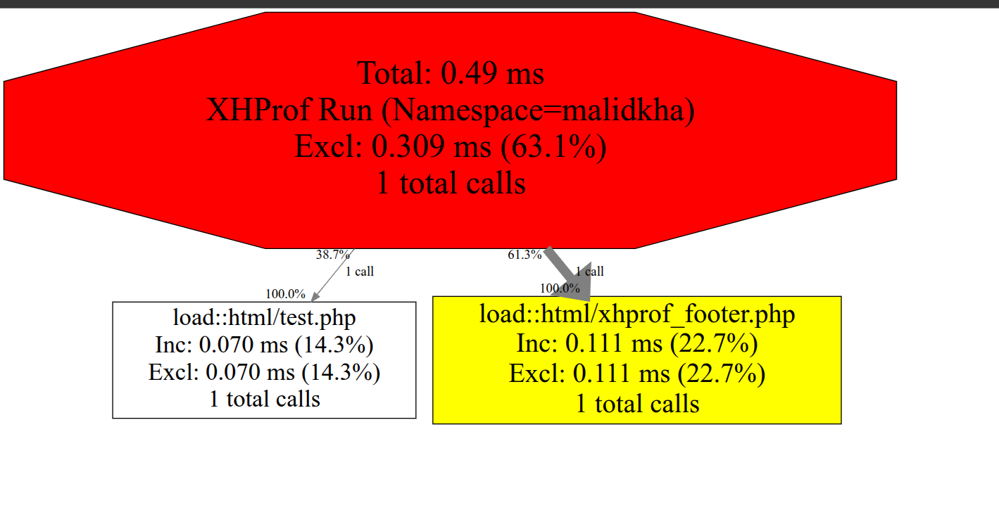

# XHProf

XHProf is a hierarchical, function-level profiler for PHP applications that collects data on function calls, CPU time, and memory usage to help identify performance bottlenecks. It works as a PHP extension to provide raw data collection and includes a simple HTML-based user interface for visualizing results, making it easier to understand code structure and compare different runs.

```
██╗  ██╗██╗  ██╗██████╗ ██████╗  ██████╗ ███████╗
╚██╗██╔╝██║  ██║██╔══██╗██╔══██╗██╔═══██╗██╔════╝
 ╚███╔╝ ███████║██████╔╝██████╔╝██║   ██║█████╗  
 ██╔██╗ ██╔══██║██╔═══╝ ██╔══██╗██║   ██║██╔══╝  
██╔╝ ██╗██║  ██║██║     ██║  ██║╚██████╔╝██║     
╚═╝  ╚═╝╚═╝  ╚═╝╚═╝     ╚═╝  ╚═╝ ╚═════╝ ╚═╝     
```
## Key Features

- **Function-Level Profiling:**  XHProf tracks metrics for each function during program execution, providing detailed insights into how different parts of your code are performing. 
    
- **Hierarchical Data:**  It presents data in a tree-like structure, allowing you to see how a particular function's execution time is broken down among its child functions and what chain of calls led to its execution. 
    
- **Key Metrics:**  XHProf collects information on:
    - **Call Counts:** The number of times a function is called. 
    - **Wall Time (Inclusive/Exclusive):** The total time spent in a function (inclusive) and the time spent only in that function's code, excluding its children (exclusive). 
    - **CPU Time:** The processor time used by the function. 
    - **Memory Usage:** The memory consumed by the function. 
    
- **Low Overhead:** Implemented as a C-based PHP extension, XHProf is designed for low overhead, minimizing its impact on application performance. 
    
- **User Interface:**  A simple HTML-based UI is included, and you can also use external tools like **XHGui** to view the profiling results. 
    
- **Comparison and Aggregation:**  It supports comparing different profiling runs to find performance changes or aggregating data from multiple runs


The original XHProf extension `phacility/xhprof`has been forked to `longxinH/xhprof` with `PHP 7 & 8` support based on a completely rewritten code-base for less overhead.

**Note** : `longxinH/xhprof` only support PHP >= 7.2 , <= 8.2 (currently), if using an older version consider the original extension `phacility/xhprof`


## XHProf Default UI

Check the docker-compose in the `default-ui` folder, the profiling data is stored in `/profiles` inside the container, not persisted on the host (consider adding a volume for it if needed)
The profiling data is displayed for each php script run

<p float="left" align="middle">
  
   
</p>
**Note** : For using this Graph we need install extension that calls: graphviz. (included in the docker-file)